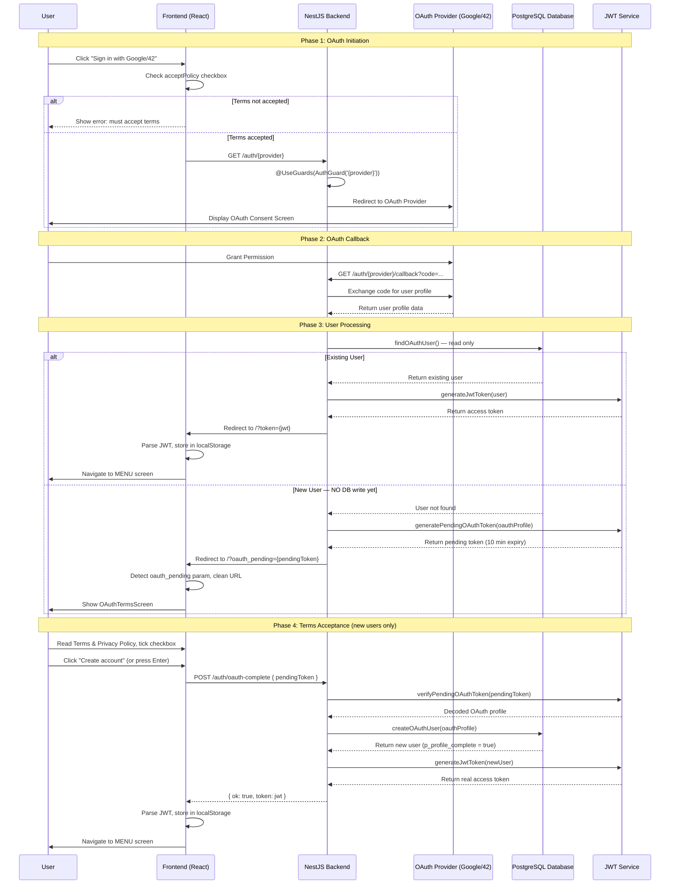
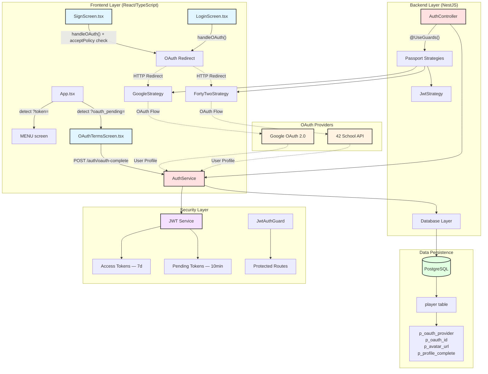

# OAuth 2.0 Remote Authentication

## Executive Summary

The OAuth 2.0 remote authentication system provides third-party authentication integration for the Transcendence platform. By implementing the industry-standard OAuth 2.0 authorization framework with Passport.js strategies, the system enables users to authenticate using their existing accounts from trusted providers including Google and 42 School Network.

The architecture decouples authentication concerns from the core application logic, leveraging NestJS guards and strategies for provider-specific implementations. **New OAuth users are required to accept the Terms of Service and Privacy Policy before their account is created**, ensuring GDPR compliance. Returning OAuth users bypass this step and are logged in directly. The system handles profile synchronization, JWT token generation, and secure session management across both traditional password-based and OAuth-based authentication flows.

---

## System Architecture Diagram

### OAuth Authentication Sequence



### OAuth System Architecture



---

## OAuth 2.0 Implementation Overview

### Supported OAuth Providers

1. **Google OAuth 2.0** — Enables authentication using Google accounts
2. **42 School Network** — Enables authentication for 42 School students and alumni

### Terms of Service Enforcement

**All users — both traditional and OAuth — must accept the Terms of Service and Privacy Policy before account creation.** The mechanism differs slightly by registration path:

| Path | Where enforced | How |
|------|---------------|-----|
| Traditional registration (`SignScreen`) | Frontend | `acceptPolicy` checkbox must be ticked before `handleForm` proceeds |
| OAuth from sign-up screen (`SignScreen`) | Frontend | `acceptPolicy` checkbox must be ticked before `handleOAuth` redirects |
| OAuth from login screen (`LoginScreen`) | Frontend + Backend | `OAuthTermsScreen` shown after callback for new users only |

**GDPR note:** For OAuth new users, **no data is written to the database** until the user explicitly accepts the terms. The OAuth profile is transported in a short-lived pending JWT (10 minutes). If the user abandons the flow, the token expires and no record is left.

### Database Schema for OAuth

The `player` table includes OAuth-specific fields and constraints:

**Drizzle ORM Schema Definition:**

```typescript
export const player = pgTable("player", {
  pPk: integer("p_pk").primaryKey().generatedAlwaysAsIdentity(),
  pNick: varchar("p_nick", { length: 255 }).notNull(),
  pMail: text("p_mail").notNull(),
  pPass: text("p_pass"),  // NULL for OAuth users

  // 2FA Fields
  pTotpSecret: bytea("p_totp_secret"),
  pTotpEnabled: boolean("p_totp_enabled").default(false),
  pTotpEnabledAt: timestamp("p_totp_enabled_at", { mode: 'string' }),
  pTotpBackupCodes: text("p_totp_backup_codes").array(),

  // OAuth Fields
  pOauthProvider: varchar("p_oauth_provider", { length: 20 }),  // 'google' or '42'
  pOauthId: varchar("p_oauth_id", { length: 255 }),             // Provider's user ID
  pAvatarUrl: varchar("p_avatar_url", { length: 500 }),         // Profile picture URL
  pProfileComplete: boolean("p_profile_complete").default(false),

  // User Information
  pReg: timestamp("p_reg", { mode: 'string' }).default(sql`CURRENT_TIMESTAMP`),
  pBir: date("p_bir"),
  pLang: char("p_lang", { length: 2 }),
  pCountry: char("p_country", { length: 2 }),
  pRole: smallint("p_role").default(1),
  pStatus: smallint("p_status").default(1),
}, (table) => [
  foreignKey({ columns: [table.pLang], foreignColumns: [pLanguage.langPk], name: "player_p_lang_fkey" }),
  foreignKey({ columns: [table.pCountry], foreignColumns: [country.coun2Pk], name: "player_p_country_fkey" }),
  unique("player_p_nick_key").on(table.pNick),
  unique("player_p_mail_key").on(table.pMail),
  unique("unique_oauth_user").on(table.pOauthProvider, table.pOauthId),
]);
```

**OAuth-Specific Fields:**

| Field | Type | Description |
|-------|------|-------------|
| `p_oauth_provider` | VARCHAR(20) | OAuth provider name: `'google'` or `'42'` |
| `p_oauth_id` | VARCHAR(255) | Provider's unique user identifier |
| `p_avatar_url` | VARCHAR(500) | Profile picture URL from OAuth provider |
| `p_profile_complete` | BOOLEAN | `true` for all accounts created after terms acceptance |
| `p_pass` | TEXT | Password hash — `NULL` for OAuth-only users |

**Important note on `p_profile_complete`:** All new OAuth accounts are created with `p_profile_complete = true` because terms acceptance is mandatory before creation. The flag now reliably indicates that the user has consented.

**Unique Constraint:**
```sql
CONSTRAINT unique_oauth_user UNIQUE(p_oauth_provider, p_oauth_id)
```
PostgreSQL treats NULL as non-equal, so multiple traditional users can have `(NULL, NULL)` without conflict.

**Example data:**

| p_pk | p_nick | p_oauth_provider | p_oauth_id | p_pass | p_profile_complete |
|------|--------|-----------------|------------|--------|--------------------|
| 1 | john_doe | NULL | NULL | $2a$10$hash... | TRUE |
| 2 | Jane_Smith | google | 1234567890 | NULL | TRUE |
| 3 | user42 | 42 | 98765 | NULL | TRUE |

---

## Frontend Implementation

### SignScreen.tsx — OAuth Registration Flow

The sign-up screen provides OAuth authentication **alongside** the terms checkbox. The `acceptPolicy` state guards both the traditional form submission and the OAuth redirect.

```typescript
const handleOAuth = (provider: 'google' | '42') => {
    // Block OAuth redirect if terms not accepted
    if (!acceptPolicy) {
        setError(t('errors.mustAcceptTerms'));
        return;
    }
    window.location.href = `/auth/${provider}`;
};
```

The terms checkbox renders with clickable links that open `TermsModal`:

```tsx
<div className="login-btn">
    <input type="checkbox" id="acceptPolicy"
        checked={acceptPolicy}
        onChange={(e) => setAcceptPolicy(e.target.checked)} />
    <label htmlFor="acceptPolicy">
        {t('privacy.prefix')}{' '}
        <a href="#" onClick={(e) => { e.preventDefault(); setShowTermsModal(true); }}>
            {t('info.terms_of_service')}
        </a>
        {' '}{t('privacy.and')}{' '}
        <a href="#" onClick={(e) => { e.preventDefault(); setShowPrivacyModal(true); }}>
            {t('info.privacy_policy')}
        </a>
        {t('privacy.suffix')}
    </label>
</div>
```

### LoginScreen.tsx — OAuth Login Flow

The login screen handles returning OAuth users (no terms required) as well as traditional and 2FA login. OAuth buttons are only shown outside of 2FA verification mode.

```typescript
const handleOAuth = (provider: 'google' | '42') => {
    window.location.href = `/auth/${provider}`;
};
```

**Note:** No terms checkbox is shown here. If a new user arrives at the login screen and authenticates via OAuth for the first time, the backend detects they don't exist and redirects to `OAuthTermsScreen` automatically. If the email is already registered under a different account, the backend redirects to `/?oauth_error=` and `LoginScreen` displays the error inline via the `oauthError` prop passed from `App.tsx`.

```typescript
type LoginScreenProps = ScreenProps & {
    setGlobalUser: (user: string) => void;
    oauthError?: string;       // Error forwarded from OAuth callback
    clearOAuthError?: () => void;
};

// Displays forwarded error on mount and clears it to prevent re-display on refresh
useEffect(() => {
    if (oauthError) {
        setError(t(oauthError));
        clearOAuthError?.();
    }
}, [oauthError]);
```

### OAuthTermsScreen.tsx — Terms Acceptance for New OAuth Users

This screen is shown exclusively to new OAuth users after the callback redirect. It carries the OAuth profile in a pending token and does not create any database record until the user explicitly accepts.

```typescript
const handleAccept = async () => {
    if (!acceptPolicy) {
        setError(t('errors.mustAcceptTerms'));
        return;
    }
    const response = await fetch('/auth/oauth-complete', {
        method: 'POST',
        headers: { 'Content-Type': 'application/json' },
        body: JSON.stringify({ pendingToken }),
    });
    const result = await response.json();
    if (result.ok) {
        // Same token handling as App.tsx normal OAuth login
        const payload = JSON.parse(atob(result.token.split('.')[1]));
        localStorage.setItem('pong_token', result.token);
        localStorage.setItem('pong_user_nick', payload.nick);
        localStorage.setItem('pong_user_id', String(payload.sub));
        setGlobalUser(payload.nick);
        dispatch({ type: 'MENU' });
    }
};
```

**Keyboard shortcuts:**
- `Enter` → equivalent to clicking "Create account"
- `Escape` → equivalent to clicking "Back"
- Both shortcuts are suppressed while a Terms or Privacy modal is open

### TermsModal.tsx — Reusable Document Viewer

A reusable modal component used in both `SignScreen` and `OAuthTermsScreen` to display the Terms of Service and Privacy Policy. Loads HTML content using the existing `loadHtmlContent` utility, which resolves the correct language file automatically from `src/local/<lang>/`.

```typescript
// Loaded via the existing loadHtmlContent utility
const html = await loadHtmlContent(fileName, i18n.language);
// fileName: "terms" | "privacy"
// Resolves to: src/local/<lang>/terms.html or src/local/<lang>/privacy.html
// Falls back to English if the language file doesn't exist
```

**Key features:**
- Lazy loading (only fetches on open, not on mount)
- Closes on `Escape` key or backdrop click
- Automatically reloads if the UI language changes while open

### auth.ts — Frontend Utility Functions

| Function | Parameters | Returns | Description |
|----------|-----------|---------|-------------|
| `checkForm` | email, password, repeat, birth | `{ok, msg}` | Client-side form validation |
| `registUser` | username, password, email, birth, country, language, enabled2FA | `{ok, msg, qrCode?, backupCodes?}` | Registers new user via `POST /auth/register` |
| `checkLogin` | username, password | `{ok, msg, user?, token?}` | Authenticates user via `POST /auth/login` |
| `send2FACode` | userId, totpCode | `{ok, msg, token?}` | Verifies 2FA code (6 digits = TOTP, 8 chars = backup code) |

### App.tsx — OAuth Callback Handler

The main App component handles OAuth token processing centrally on mount.

**Token detection (runs once on mount):**

```typescript
useEffect(() => {
    const params = new URLSearchParams(window.location.search);

    // Normal login / returning OAuth user
    const token = params.get('token');
    if (token) {
        const payload = JSON.parse(decodeURIComponent(
            window.atob(token.split('.')[1].replace(/-/g, '+').replace(/_/g, '/'))
                .split('').map(c => '%' + ('00' + c.charCodeAt(0).toString(16)).slice(-2)).join('')
        ));
        localStorage.setItem("pong_token", token);
        localStorage.setItem("pong_user_nick", payload.nick);
        localStorage.setItem("pong_user_id", payload.sub.toString());
        setCurrentUser(payload.nick);
        setCurrentUserId(Number(payload.sub));
        window.history.replaceState({}, document.title, window.location.pathname);
        dispatch({ type: "MENU" });
    }

    // New OAuth user — terms not yet accepted
    const pendingToken = params.get('oauth_pending');
    if (pendingToken) {
        window.history.replaceState({}, document.title, window.location.pathname);
        setPendingOAuthToken(pendingToken);
        dispatch({ type: "OAUTH_TERMS" });
    }

    // OAuth callback error (e.g. email already registered under a different account)
    const oauthError = params.get('oauth_error');
    if (oauthError) {
        window.history.replaceState({}, document.title, window.location.pathname);
        setOAuthError(decodeURIComponent(oauthError));
        dispatch({ type: "LOGIN" });
    }
}, []);
```

**Screen state:**
- `pendingOAuthToken` state holds the pending JWT string — passed to `OAuthTermsScreen`
- `oauthError` state holds the forwarded error key — passed to `LoginScreen` as a prop
- `"oauth_terms"` screen case renders `OAuthTermsScreen` with the token

**Profile synchronization** (unchanged — runs whenever `currentUser` becomes truthy):

```typescript
useEffect(() => {
    if (!currentUser) return;
    const syncProfile = async () => {
        const profile = await getMyProfile();
        if (profile) {
            setCurrentUserId(profile.id);
            setCurrentUserAvatarUrl(profile.avatarUrl ?? null);
            localStorage.setItem("pong_user_id", String(profile.id));
        }
        setProfileSynced(true);
    };
    syncProfile();
}, [currentUser]);
```

### screenReducer.ts

```typescript
export function screenReducer(state: Screen, action: Action): Screen {
  switch (action.type) {
    case "MENU":        return "menu";
    case "LOGIN":       return "login";
    case "SIGN":        return "sign";
    case "SETTINGS":    return "settings";
    case "PROFILE":     return "profile";
    case "STATS":       return "stats";
    case "PONG":        return "pong";
    case "LOGOUT":      return "login";
    case "INFO":        return "info";
    case "OAUTH_TERMS": return "oauth_terms";   // ← New OAuth terms screen
    default:            return state;
  }
}
```

**Note:** `types.ts` must include `"oauth_terms"` in the `Screen` union and `{ type: "OAUTH_TERMS" }` in the `Action` union.

---

## Data Transfer Objects (DTOs)

### RegisterUserDto

Validates traditional user registration requests.

```typescript
export class RegisterUserDto {
  @IsString()
  @IsNotEmpty()
  @MaxLength(20)
  user: string;

  @IsEmail()
  @IsNotEmpty()
  email: string;

  @IsString()
  @IsNotEmpty()
  @MinLength(8)
  password: string;
}
```

OAuth registration bypasses this DTO as users are created server-side via `createOAuthUser()`.

### CompleteProfileDto

Validates profile completion requests.

```typescript
export class CompleteProfileDto {
  @IsString()
  @Length(2, 2)
  country: string;  // 2-letter ISO country code

  @IsString()
  @Length(2, 2)
  language: string; // 2-letter ISO language code
}
```

---

## Backend Implementation

### AuthController — OAuth Endpoints

**Callback behaviour (updated):**

Both OAuth callbacks now branch on whether the user already exists in the database:

```typescript
@Get('google/callback')
@UseGuards(AuthGuard('google'))
async googleAuthRedirect(@Req() req, @Res() res: Response) {
    const frontendUrl = this.configService.get<string>('VITE_FRONTEND_URL') || 'https://localhost:8443';

    // Check if user already exists — read only, no DB write
    const existing = await this.authService.findOAuthUser(req.user);
    if (existing) {
        // Returning user → login normally
        const { accessToken } = this.authService.generateJwtToken(existing);
        return res.redirect(`${frontendUrl}/?token=${accessToken}`);
    }

    // New user → send pending token, do NOT create account yet
    const pendingToken = this.authService.generatePendingOAuthToken(req.user);
    res.redirect(`${frontendUrl}/?oauth_pending=${pendingToken}`);
}
```

The 42 School callback follows identical logic.

**New endpoint — Terms acceptance:**

```typescript
@Post('oauth-complete')
async oauthComplete(@Body() body: { pendingToken: string }) {
    // Verify the pending token (signed with JWT_SECRET, 10min expiry)
    const oauthData = this.authService.verifyPendingOAuthToken(body.pendingToken);
    if (!oauthData) {
        return { ok: false, msg: 'errors.invalidOrExpiredToken' };
    }
    try {
        // Only now do we write to the database
        const newUser = await this.authService.createOAuthUser(oauthData);
        const { accessToken } = this.authService.generateJwtToken(newUser);
        return { ok: true, token: accessToken };
    } catch (e: any) {
        if (e?.status === 409) return { ok: false, msg: 'errors.userOrEmailExists' };
        return { ok: false, msg: 'errors.unknownError' };
    }
}
```

### AuthService — OAuth User Management

**`findOAuthUser`** — read-only lookup, used by callbacks to distinguish new vs returning users:

```typescript
async findOAuthUser(oauthData: { oauthId: string; oauthProvider: string }) {
    const result = await this.db.select().from(player)
        .where(and(
            eq(player.pOauthProvider, oauthData.oauthProvider),
            eq(player.pOauthId, oauthData.oauthId),
        )).limit(1);
    return result.length > 0 ? result[0] : null;
}
```

**`createOAuthUser`** — called only after terms acceptance, writes to DB:

```typescript
async createOAuthUser(oauthData: { ... }) {
    // Check for duplicate email
    // Resolve nick conflicts with random suffix
    // Insert with p_profile_complete = true (terms accepted at creation)
    const newUser = await this.db.insert(player).values({
        pNick: finalNick,
        pMail: oauthData.email,
        pOauthProvider: oauthData.oauthProvider,
        pOauthId: oauthData.oauthId,
        pAvatarUrl: oauthData.avatarUrl,
        pLang: oauthData.lang || 'ca',
        pCountry: oauthData.country || 'FR',
        pProfileComplete: true,  // Terms accepted before this call
        pPass: null,
        pTotpEnabled: false,
        // ...
    }).returning();
    return newUser[0];
}
```

**`findOrCreateOAuthUser`** — kept as a thin wrapper for backwards compatibility:

```typescript
async findOrCreateOAuthUser(oauthData) {
    const existing = await this.findOAuthUser(oauthData);
    if (existing) return existing;
    return this.createOAuthUser(oauthData);
}
```

**Pending token methods:**

```typescript
// Encodes OAuth profile in a short-lived JWT (10 min) — no DB write
generatePendingOAuthToken(oauthData: { ... }) {
    return this.jwtService.sign(
        { oauth_pending: true, ...oauthData },
        { expiresIn: '10m' }
    );
}

// Verifies and decodes a pending token; returns null if invalid or expired
verifyPendingOAuthToken(token: string) {
    try {
        const payload = this.jwtService.verify(token) as any;
        if (!payload.oauth_pending) return null;
        return { oauthId, oauthProvider, email, nick, avatarUrl, lang, country };
    } catch {
        return null;
    }
}
```

**JWT token generation** (unchanged):

```typescript
generateJwtToken(user: any) {
    const payload: JwtPayload = {
        sub: user.pPk,
        email: user.pMail,
        nick: user.pNick,
    };
    return { accessToken: this.jwtService.sign(payload) };  // 7-day expiry
}
```

### AuthModule — OAuth Configuration

```typescript
@Module({
  imports: [
    PassportModule.register({ defaultStrategy: 'jwt' }),
    ConfigModule,
    DatabaseModule,
    JwtModule.registerAsync({
      imports: [ConfigModule],
      inject: [ConfigService],
      useFactory: async (configService: ConfigService) => ({
        secret: configService.get<string>('JWT_SECRET'),
        signOptions: { expiresIn: '7d' },
      }),
    }),
    HttpModule.register({ timeout: 5000, maxRedirects: 5 }),
  ],
  controllers: [AuthController],
  providers: [AuthService, JwtStrategy, JwtAuthGuard, GoogleStrategy, FortyTwoStrategy],
  exports: [AuthService, JwtAuthGuard, JwtStrategy],
})
export class AuthModule {}
```

**Required Environment Variables:**

```bash
JWT_SECRET=your-super-secret-jwt-key-change-this-in-production-min-32-chars
JWT_EXPIRATION=7d

OAUTH_42_CLIENT_ID=u-s4t2ud-your-42-client-id-here
OAUTH_42_CLIENT_SECRET=s-s4t2ud-your-42-client-secret-here
OAUTH_42_CALLBACK_URL=https://yourdomain.com/auth/42/callback

OAUTH_GOOGLE_CLIENT_ID=123456789-xxx.apps.googleusercontent.com
OAUTH_GOOGLE_CLIENT_SECRET=GOCSPX-your-google-client-secret
OAUTH_GOOGLE_CALLBACK_URL=https://yourdomain.com/auth/google/callback

VITE_FRONTEND_URL=https://yourdomain.com
```

---

## OAuth Strategy Implementation

### GoogleStrategy

```typescript
@Injectable()
export class GoogleStrategy extends PassportStrategy(Strategy, 'google') {
  constructor(private configService: ConfigService, private authService: AuthService) {
    super({
      clientID: configService.get<string>('OAUTH_GOOGLE_CLIENT_ID') || '',
      clientSecret: configService.get<string>('OAUTH_GOOGLE_CLIENT_SECRET') || '',
      callbackURL: configService.get<string>('OAUTH_GOOGLE_CALLBACK_URL') || '',
      scope: ['email', 'profile'],
    });
  }

  async validate(accessToken, refreshToken, profile, done) {
    const { id, displayName, emails, photos, _json } = profile;
    let lang = 'ca', country = 'FR';
    if (_json.locale) {
      const parts = _json.locale.split('-');
      if (parts.length > 0) lang = parts[0];
      if (parts.length > 1) country = parts[1].toUpperCase();
    }
    const photoUrl = photos?.[0]?.value;
    done(null, {
      oauthId: id,
      oauthProvider: 'google',
      email: emails?.[0]?.value,
      nick: displayName.replace(/\s+/g, '_').substring(0, 20),
      avatarUrl: photoUrl?.split('=')?.[0] ?? photoUrl,
      lang,
      country,
    });
  }
}
```

**Key features:** Locale parsing (`"en-US"` → `lang="en"`, `country="US"`); avatar URL parameter removal for full resolution; nickname sanitization (spaces → underscores, max 20 chars).

### FortyTwoStrategy

```typescript
@Injectable()
export class FortyTwoStrategy extends PassportStrategy(Strategy, '42') {
  constructor(private configService: ConfigService, private authService: AuthService) {
    super({
      clientID: configService.get<string>('OAUTH_42_CLIENT_ID'),
      clientSecret: configService.get<string>('OAUTH_42_CLIENT_SECRET'),
      callbackURL: configService.get<string>('OAUTH_42_CALLBACK_URL'),
      scope: ['public'],
      authorizationURL: 'https://api.intra.42.fr/oauth/authorize',
      tokenURL: 'https://api.intra.42.fr/oauth/token',
    });
  }

  async validate(accessToken, refreshToken, profile) {
    const { id, username, emails } = profile;
    const avatarUrl = profile._json?.image?.versions?.medium
                   || profile._json?.image?.link
                   || null;
    const lang = profile._json?.campus?.[0]?.language?.identifier || 'ca';
    const campusCountry = profile._json?.campus?.[0]?.country || null;
    const countryCode = await this.authService.getCountryCode(campusCountry);
    return {
      oauthId: id,
      oauthProvider: '42',
      email: emails?.[0]?.value || `${username}@student.42.fr`,
      nick: username,
      avatarUrl,
      lang,
      country: countryCode,
    };
  }
}
```

**Key features:** Campus data extraction for language and country; multi-source avatar resolution; `@student.42.fr` email fallback; `require()` syntax for `passport-42` (TypeScript import incompatibility).

### JwtStrategy

```typescript
@Injectable()
export class JwtStrategy extends PassportStrategy(Strategy) {
  constructor(private configService: ConfigService) {
    super({
      jwtFromRequest: ExtractJwt.fromAuthHeaderAsBearerToken(),
      ignoreExpiration: false,
      secretOrKey: configService.get<string>('JWT_SECRET') || 'fallback-secret-key',
    });
  }

  async validate(payload: JwtPayload) {
    return { sub: payload.sub, email: payload.email, nick: payload.nick };
  }
}
```

### JwtAuthGuard

```typescript
@Injectable()
export class JwtAuthGuard extends AuthGuard('jwt') {}
```

---

## API Endpoints Reference

| Method | Endpoint | Guards | Description |
|--------|----------|--------|-------------|
| POST | `/auth/login` | None | Traditional username/password login |
| POST | `/auth/register` | None | Traditional user registration |
| POST | `/auth/verify-totp` | None | Verify 2FA TOTP code (6 digits) |
| POST | `/auth/verify-backup` | None | Verify 2FA backup code (8 chars) |
| GET | `/auth/google` | AuthGuard('google') | Initiate Google OAuth flow |
| GET | `/auth/google/callback` | AuthGuard('google') | Google OAuth callback — returns `?token=` or `?oauth_pending=` |
| GET | `/auth/42` | AuthGuard('42') | Initiate 42 School OAuth flow |
| GET | `/auth/42/callback` | AuthGuard('42') | 42 School OAuth callback — returns `?token=` or `?oauth_pending=` |
| **POST** | **`/auth/oauth-complete`** | **None** | **Complete new OAuth registration after terms acceptance** |
| GET | `/auth/profile` | JwtAuthGuard | Get current user profile |
| PUT | `/auth/profile` | JwtAuthGuard | Update user profile |
| DELETE | `/auth/profile` | JwtAuthGuard | Anonymize (soft-delete) user account |
| GET | `/auth/countries` | None | Get list of all countries |

---

## CORS Configuration

```typescript
app.enableCors({
    origin: true,  // Reflects request origin (use specific origins in production)
    methods: 'GET,HEAD,PUT,PATCH,POST,DELETE,OPTIONS',
    credentials: true,
    allowedHeaders: 'Content-Type, Accept, Authorization',
    preflightContinue: false,
    optionsSuccessStatus: 204,
});
await app.listen(port, '0.0.0.0');  // CRITICAL for Docker
```

---

## Security Considerations

1. **Terms acceptance before data storage** — No personal data from OAuth providers is written to the database until the user explicitly consents. The pending JWT carries the profile temporarily in memory only.

2. **Pending token expiry** — Pending OAuth tokens expire after 10 minutes. An abandoned terms flow leaves no database record and no cleanup is needed.

3. **Same signing secret** — Pending tokens are signed with the same `JWT_SECRET` as regular tokens but carry an `oauth_pending: true` claim. `verifyPendingOAuthToken` rejects any token that lacks this claim, preventing regular JWT tokens from being submitted to `/auth/oauth-complete`.

4. **State parameter validation** — Handled automatically by Passport, preventing CSRF attacks during OAuth flow.

5. **Password handling for OAuth users** — OAuth users have `p_pass = NULL`. Traditional login is rejected with a clear error. Password changes are blocked in profile updates for OAuth accounts.

6. **HTTPS in production** — All callback URLs must use HTTPS. HTTP is acceptable only for localhost development.

7. **JWT token payload:**
    ```json
    {
      "sub": 123,
      "nick": "username",
      "email": "user@example.com",
      "iat": 1234567890,
      "exp": 1235172690
    }
    ```

8. **LocalStorage persistence** — Tokens stored in `localStorage` persist across sessions. Always validate server-side using `JwtAuthGuard`. Clear on logout.

---

## OAuth Flow Detailed Steps

### New OAuth User (First Login)

1. User clicks OAuth button (on `SignScreen`: terms checkbox must be ticked first)
2. Frontend redirects to `/auth/{provider}`
3. Backend triggers Passport redirect to provider consent screen
4. User grants permission → provider redirects to `/auth/{provider}/callback`
5. `GoogleStrategy` / `FortyTwoStrategy` validates and returns profile data
6. `AuthController` calls `findOAuthUser()` → checks by OAuth identity, then checks for email conflict
   - If email already registered under a different account → redirects to `/?oauth_error=errors.userOrEmailExists`
   - `App.tsx` detects `oauth_error`, cleans URL, dispatches `LOGIN` — error displayed on LoginScreen
7. User not found and email free → `generatePendingOAuthToken()` creates a 10-minute JWT with the OAuth profile
8. Backend redirects to `/?oauth_pending={pendingToken}`
9. `App.tsx` detects `oauth_pending` param, cleans URL, dispatches `OAUTH_TERMS`
10. `OAuthTermsScreen` is rendered with the pending token
11. User reads Terms of Service and Privacy Policy (via modal), ticks checkbox
12. User clicks "Create account" (or presses `Enter`)
13. `POST /auth/oauth-complete` sent with pending token
14. Backend verifies token, calls `createOAuthUser()`, returns real JWT
15. Frontend stores token in `localStorage`, navigates to `MENU`

### Returning OAuth User

1. User clicks OAuth button
2–5. (Same as above)
6. `AuthController` calls `findOAuthUser()` → user found
7. `generateJwtToken()` creates a real 7-day JWT
8. Backend redirects to `/?token={jwt}`
9. `App.tsx` detects `token` param, stores in `localStorage`, navigates to `MENU`

---

## Error Handling

| Error Scenario | Response | Handling |
|---------------|----------|----------|
| Terms checkbox not ticked (SignScreen OAuth) | Frontend blocks redirect | Error message shown inline |
| Pending token expired (>10 min on terms screen) | `{ ok: false, msg: 'errors.invalidOrExpiredToken' }` | Error shown, user redirected to login |
| Duplicate email on `createOAuthUser` | 409 ConflictException | `{ ok: false, msg: 'errors.userOrEmailExists' }` |
| OAuth provider unavailable | Passport throws error | User sees connection error |
| User denies OAuth permission | Provider redirects with error | No user created, return to login |
| JWT secret not configured | JwtModule initialization fails | Application startup error |

---

## Integration with Existing Features

### 2FA Compatibility

OAuth users are created with 2FA disabled by default (`p_totp_enabled = false`, `p_totp_secret = null`). Future enhancement: allow OAuth users to enable TOTP.

### Avatar System

OAuth profiles include avatar URLs stored in `p_avatar_url`. The avatar is **not** included in the JWT — `App.tsx` fetches it separately via `getMyProfile()` after login to keep the JWT small.

### i18n — Translation Keys Required

The following keys must be present in all language files (`src/local/<lang>/translation_<lang>.json`):

```json
{
  "privacy": {
    "prefix": "I have read and agree to the",
    "and": "and",
    "suffix": "."
  },
  "oauth_terms": {
    "title": "One last step",
    "subtitle": "Before we create your account, please read and accept our terms.",
    "confirm_btn": "Create account"
  },
  "errors": {
    "mustAcceptTerms": "You must accept the Terms of Use and Privacy Policy to register.",
    "invalidOrExpiredToken": "This link has expired. Please try signing in again."
  },
  "modal": {
    "loading": "Loading...",
    "cancel_btn": "close"
  }
}
```

---

## Testing OAuth Integration

### Development Testing Checklist

- [ ] Google OAuth credentials configured in `.env`
- [ ] 42 School OAuth credentials configured in `.env`
- [ ] Callback URLs match environment configuration
- [ ] Frontend URL configured correctly in `VITE_FRONTEND_URL`
- [ ] Database migrations applied (all OAuth columns exist)
- [ ] JWT secret configured (minimum 32 characters)
- [ ] CORS enabled for frontend origin

### Manual Testing Flow

1. **New user via OAuth (from SignScreen):**
   - Leave terms checkbox unticked → click Google/42 → verify error is shown
   - Tick terms checkbox → click Google/42 → complete OAuth consent
   - Verify `OAuthTermsScreen` is NOT shown (checkbox was already ticked on SignScreen)
   - Verify user is created in database with `p_profile_complete = true`

2. **New user via OAuth (from LoginScreen):**
   - Click Google/42 on LoginScreen → complete OAuth consent
   - Verify `OAuthTermsScreen` is shown
   - Leave checkbox unticked → click "Create account" → verify error is shown
   - Tick checkbox → click "Create account" (or press `Enter`)
   - Verify user is created in database and navigated to `MENU`
   - Verify `Escape` on terms screen navigates back to login

3. **Returning OAuth user:**
   - Authenticate with the same provider again
   - Verify `OAuthTermsScreen` is NOT shown
   - Verify navigation goes directly to `MENU`

4. **Pending token expiry:**
   - Initiate new OAuth flow, wait >10 minutes on terms screen
   - Click "Create account" → verify expired token error is shown

5. **Traditional registration:**
   - Leave terms checkbox unticked → click submit → verify error
   - Tick terms → submit → verify normal registration flow

---

## Dependencies

### Backend

```json
{
  "@nestjs/passport": "^11.0.0",
  "@nestjs/jwt": "^11.0.0",
  "passport": "^0.7.0",
  "passport-google-oauth20": "^2.0.0",
  "passport-42": "^1.2.6",
  "bcryptjs": "^3.0.3"
}
```

### Frontend

```json
{
  "react": "^18.3.1",
  "i18next": "^23.x",
  "react-i18next": "^13.x",
  "qrcode.react": "^3.x"
}
```

---

## Configuration Files

### docker-compose.yml (OAuth Environment)

```yaml
services:
  backend:
    environment:
      DATABASE_URL: ${DATABASE_URL}
      JWT_SECRET: ${JWT_SECRET}
      JWT_EXPIRATION: ${JWT_EXPIRATION}
      OAUTH_42_CLIENT_ID: ${OAUTH_42_CLIENT_ID}
      OAUTH_42_CLIENT_SECRET: ${OAUTH_42_CLIENT_SECRET}
      OAUTH_42_CALLBACK_URL: ${OAUTH_42_CALLBACK_URL}
      OAUTH_GOOGLE_CLIENT_ID: ${OAUTH_GOOGLE_CLIENT_ID}
      OAUTH_GOOGLE_CLIENT_SECRET: ${OAUTH_GOOGLE_CLIENT_SECRET}
      OAUTH_GOOGLE_CALLBACK_URL: ${OAUTH_GOOGLE_CALLBACK_URL}
      VITE_FRONTEND_URL: ${VITE_FRONTEND_URL}
      TOTP_SERVICE_URL: http://totp:8070
```

---

## File Structure Reference

```
transcendence/
├── frontend/
│   └── src/
│       ├── screens/
│       │   ├── SignScreen.tsx          # Traditional + OAuth signup (terms checkbox guards both)
│       │   ├── LoginScreen.tsx         # Login (OAuth buttons, 2FA support)
│       │   ├── OAuthTermsScreen.tsx    # NEW — Terms acceptance for new OAuth users
│       │   └── ProfileScreen.tsx       # Profile editing
│       ├── components/
│       │   └── TermsModal.tsx          # NEW — Reusable Terms/Privacy modal viewer
│       ├── ts/
│       │   ├── utils/
│       │   │   ├── auth.ts             # Auth utility functions (API calls)
│       │   │   └── loadHtmlContent.ts  # Loads HTML docs by language (used by TermsModal)
│       │   └── screenConf/
│       │       └── screenReducer.ts    # Screen state machine (includes OAUTH_TERMS)
│       ├── local/
│       │   ├── en/ ca/ es/ fr/
│       │   │   ├── terms.html          # Terms of Service (per language)
│       │   │   └── privacy.html        # Privacy Policy (per language)
│       │   └── <lang>/translation_<lang>.json
│       ├── App.tsx                     # OAuth callback handler (?token=, ?oauth_pending=, ?oauth_error=)
│       └── main.tsx
│
└── backend/
    └── src/
        └── auth/
            ├── auth.controller.ts      # OAuth callbacks + POST /auth/oauth-complete
            ├── auth.service.ts         # findOAuthUser, createOAuthUser, pending token methods
            ├── auth.module.ts          # Module configuration
            ├── strategies/
            │   ├── google.strategy.ts
            │   ├── fortytwo.strategy.ts
            │   └── jwt.strategy.ts
            └── guards/
                └── jwt-auth.guard.ts
```

**Key File Locations:**

| File | Purpose | Key Changes |
|------|---------|-------------|
| `frontend/src/App.tsx` | OAuth callback handler | Handles `?token=`, `?oauth_pending=`, `?oauth_error=` params |
| `frontend/src/screens/OAuthTermsScreen.tsx` | **New** — Terms for new OAuth users | New file |
| `frontend/src/components/TermsModal.tsx` | **New** — Document viewer modal | New file |
| `frontend/src/ts/screenConf/screenReducer.ts` | Screen state machine | Added `OAUTH_TERMS` case |
| `frontend/src/screens/SignScreen.tsx` | Registration UI | `acceptPolicy` guards OAuth buttons |
| `backend/src/auth/auth.controller.ts` | OAuth routes | Callbacks branch on new/returning; new `/oauth-complete` endpoint |
| `backend/src/auth/auth.service.ts` | Auth business logic | `findOAuthUser`, `createOAuthUser`, pending token methods |

---

## Known Limitations

1. **OAuth-only users cannot set passwords** — `p_pass = NULL` by design. Password changes blocked in profile update.
2. **Email uniqueness across providers** — Same email with different providers creates separate accounts. Future enhancement: account linking.
3. **2FA not available for OAuth users** — Created with 2FA disabled. Future enhancement: optional TOTP for OAuth accounts.

---

## Future Enhancements

1. **Account linking** — Allow users to link multiple OAuth providers to one account
2. **Additional providers** — GitHub, Microsoft/Azure AD, Discord, Apple Sign In
3. **2FA for OAuth users** — Optional TOTP setup after OAuth login
4. **OAuth token refresh** — Store and manage provider refresh tokens for extended sessions

---

## Obtaining OAuth Credentials

### Google OAuth Setup

1. Go to [Google Cloud Console](https://console.cloud.google.com/)
2. Create or select a project
3. Enable the Google+ API
4. Navigate to "Credentials" → "Create Credentials" → "OAuth 2.0 Client ID"
5. Configure the OAuth consent screen
6. Add authorized redirect URIs:
   - Development: `http://localhost:3000/auth/google/callback`
   - Production: `https://yourdomain.com/auth/google/callback`
7. Copy Client ID and Secret to `.env`

### 42 School OAuth Setup

1. Go to [42 Intra OAuth Applications](https://profile.intra.42.fr/oauth/applications)
2. Click "Register a new application"
3. Set redirect URI: `https://yourdomain.com/auth/42/callback`
4. Copy UID and SECRET to `.env`

---

## Credits

- **NestJS Passport Module** — OAuth integration framework
- **Passport.js** — Authentication middleware
- **Google OAuth 2.0** — Google authentication provider
- **42 School API** — 42 Network authentication provider

## License

This OAuth implementation follows the same license as the Transcendence project.

[Return to Main modules table](../../../README.md#modules)
