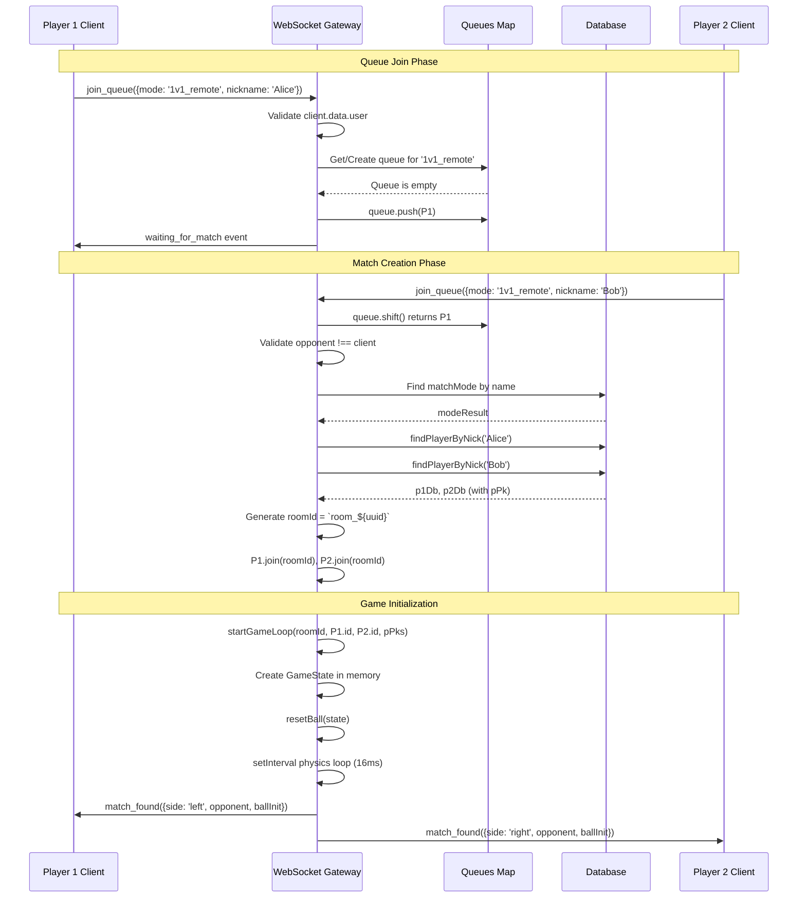
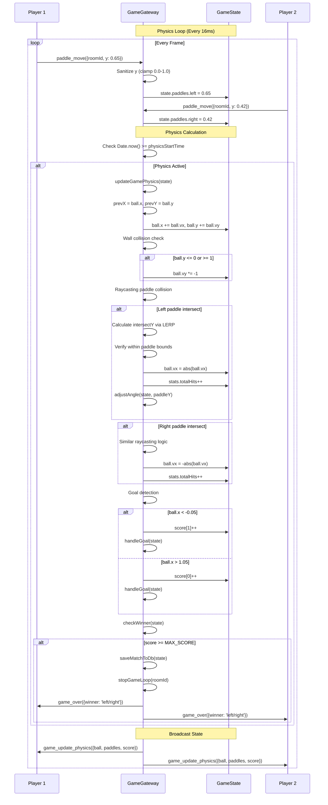
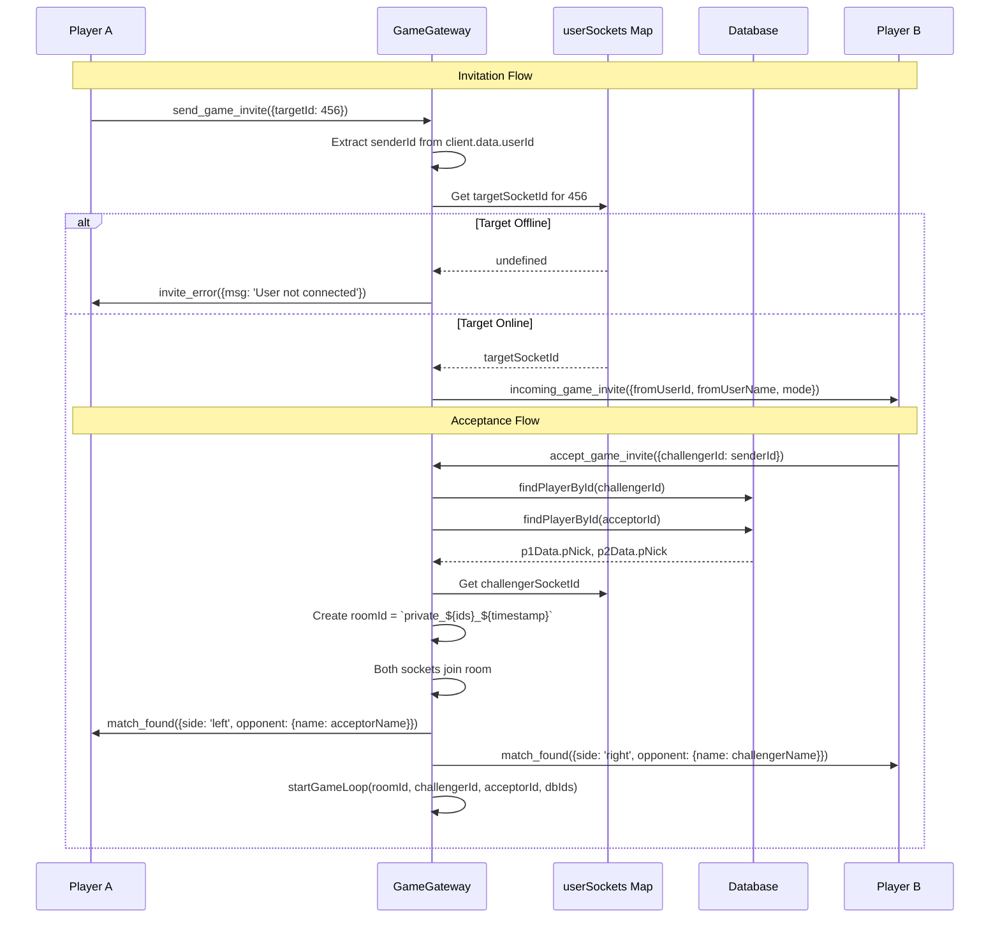
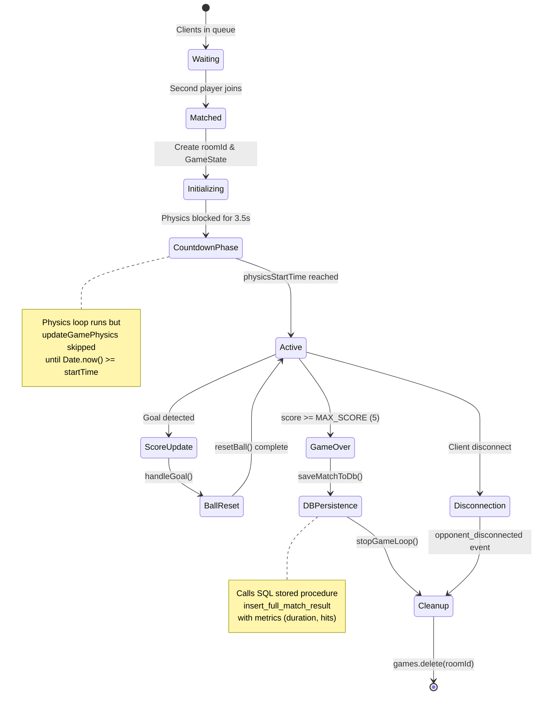
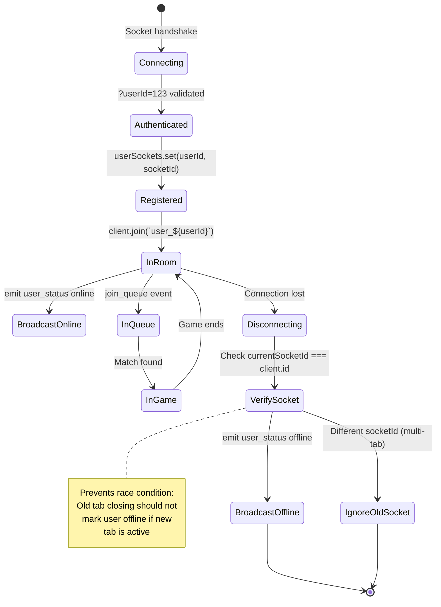

# Pong Game - Backend Documentation

## Executive Summary

The backend establishes a server-authoritative, real-time multiplayer Pong infrastructure using NestJS WebSocket Gateway architecture. By implementing deterministic physics simulation with raycasting-based collision detection, the system ensures competitive integrity while supporting matchmaking, game state synchronization, and persistent match history recording.

The architecture leverages Socket.IO for bidirectional communication, Drizzle ORM for database operations, and interval-based physics loops running at fixed 60 FPS. The gateway manages user presence tracking, queue-based matchmaking, in-memory game state, and PostgreSQL persistence through stored procedures, ensuring scalability and maintainability.

---

## System Architecture Overview

### Backend Component Diagram

```mermaid
graph TD
    subgraph "NestJS Layer"
        GW[GameGateway] --> WS[WebSocket Server]
        GW --> DB[(Drizzle ORM)]
    end

    subgraph "Connection Management"
        WS --> HC[handleConnection]
        WS --> HD[handleDisconnect]
        HC --> US[userSockets Map]
        HC --> USR[User Status Broadcast]
    end

    subgraph "Matchmaking System"
        JQ[join_queue Handler] --> QM[Queues Map<mode, Socket[]>]
        QM --> MM[Match Found Logic]
        MM --> SGL[startGameLoop]
    end

    subgraph "Game Engine"
        SGL --> GS[GameState Map<roomId, State>]
        GS --> PI[Physics Interval 60 FPS]
        PI --> UGP[updateGamePhysics]
        UGP --> CC[Collision Checks]
        UGP --> AA[adjustAngle]
        UGP --> RB[resetBall]
    end

    subgraph "Real-time Sync"
        PI --> BC[Broadcast game_update_physics]
        BC --> C1[Client 1]
        BC --> C2[Client 2]
        C1 --> PM[paddle_move Event]
        C2 --> PM
        PM --> GS
    end

    subgraph "Persistence Layer"
        CW[checkWinner] --> SMD[saveMatchToDb]
        SMD --> SPF[SQL Stored Procedure]
        SPF --> DB
    end

    style GW fill:#bbf,stroke:#333,stroke-width:2px
    style GS fill:#fdd,stroke:#333,stroke-width:2px
    style DB fill:#dfd,stroke:#333,stroke-width:2px
```

---

## Sequence Diagrams

### Matchmaking Flow - Queue-Based Pairing



### Game Loop - Server-Authoritative Physics



### Invitation System - Friend Challenge



---

## State Machine Diagrams

### Game State Lifecycle



### Connection State Management



---

## Data Flow Diagrams

### Matchmaking Data Pipeline

```mermaid
graph LR
    subgraph "Input Stage"
        C1[Client 1] -->|join_queue DTO| GW[GameGateway]
        C2[Client 2] -->|join_queue DTO| GW
    end
    
    subgraph "Validation Layer"
        GW --> VL[Validate client.data]
        VL --> QG[Get/Create Queue]
    end
    
    subgraph "Queue Management"
        QG --> QL{Queue Length}
        QL -->|Empty| PUSH[queue.push client]
        QL -->|>= 1| SHIFT[queue.shift opponent]
        SHIFT --> VALID{Validate Match}
        VALID -->|Self-match| PUSH
        VALID -->|Valid| DBQ[DB Query]
    end
    
    subgraph "Database Layer"
        DBQ --> FM[Find matchMode]
        DBQ --> FP1[Find Player 1 by Nick]
        DBQ --> FP2[Find Player 2 by Nick]
        FM --> PKS[Extract pPk IDs]
        FP1 --> PKS
        FP2 --> PKS
    end
    
    subgraph "Game Initialization"
        PKS --> GEN[Generate UUID roomId]
        GEN --> JOIN[Sockets join room]
        JOIN --> SGL[startGameLoop]
        SGL --> GS[Create GameState]
    end
    
    subgraph "Client Notification"
        GS --> MF1[match_found to P1]
        GS --> MF2[match_found to P2]
    end
    
    style GW fill:#bbf,stroke:#333,stroke-width:2px
    style GS fill:#fdd,stroke:#333,stroke-width:2px
```



### Real-time Sync Data Flow

```mermaid
graph TB
    subgraph "Client Input"
        KB1[Keyboard P1] --> PME1[paddle_move emit]
        KB2[Keyboard P2] --> PME2[paddle_move emit]
    end
    
    subgraph "Server Reception"
        PME1 --> DTO[PaddleMoveDto Validation]
        PME2 --> DTO
        DTO --> CLAMP[Sanitize y to 0.0-1.0]
    end
    
    subgraph "State Update"
        CLAMP --> GSU[GameState Update]
        GSU --> PL[paddles.left = y]
        GSU --> PR[paddles.right = y]
    end
    
    subgraph "Physics Engine"
        INT[setInterval 16ms] --> CHK{Time Check}
        CHK -->|Too Early| SKIP[Skip Physics]
        CHK -->|Active| UGP[updateGamePhysics]
        UGP --> READ_P[Read paddles.left/right]
        READ_P --> CALC[Ball Movement]
        CALC --> COLL[Collision Detection]
        COLL --> SCORE[Score Update]
    end
    
    subgraph "Broadcasting"
        SCORE --> PKG[Package State]
        PKG --> BALL_PKG[ball: {x, y}]
        PKG --> PAD_PKG[paddles: {left, right}]
        PKG --> SCR_PKG[score: [n, m]]
        
        BALL_PKG --> EMIT[emit to room]
        PAD_PKG --> EMIT
        SCR_PKG --> EMIT
        
        EMIT --> C1[Client 1]
        EMIT --> C2[Client 2]
    end
    
    style UGP fill:#fdd,stroke:#333,stroke-width:2px
    style GSU fill:#dfd,stroke:#333,stroke-width:2px
```

---

## Component Reference Documentation

### GameGateway - Main WebSocket Controller

**Purpose**: Manages WebSocket lifecycle, matchmaking logic, game state orchestration, and database persistence.

**Decorators & Configuration**:
```typescript
@UsePipes(new ValidationPipe({ whitelist: true }))
@WebSocketGateway({
  cors: { origin: '*' },
  transports: ['websocket']
})
```

**Class Properties**:
```typescript
@WebSocketServer() server: Server;

// Mapa para gestionar colas por modo de juego (ej: '1v1_remote' -> [Socket])
private queues: Map<string, Socket[]> = new Map();

// ALMACÉN DE PARTIDAS ACTIVAS
private games: Map<string, GameState> = new Map();

// NUEVO: MAPA DE USUARIOS CONECTADOS (UserId -> SocketId)
private userSockets = new Map<number, string>();

// Constantes de física del servidor (Ajustables)
private readonly SERVER_WIDTH = 1.0;
private readonly SERVER_HEIGHT = 1.0;
private readonly PADDLE_HEIGHT = 0.2;
private readonly INITIAL_SPEED = 0.01;
private readonly SPEED_INCREMENT = 1.02;
private readonly MAX_SCORE = 5;
```

**GameState Interface**:
```typescript
interface GameState {
  roomId: string;
  playerLeftDbId: number;     // PK for DB persistence
  playerRightDbId: number;
  playerLeftId: string;       // Socket ID
  playerRightId: string;
  ball: {
    x: number;      // Posición X (0.0 a 1.0)
    y: number;      // Posición Y (0.0 a 1.0)
    vx: number;     // Velocidad X
    vy: number;     // Velocidad Y
    speed: number;  // Velocidad escalar
  };
  paddles: {
    left: number;   // Y del jugador izq (0.0 a 1.0)
    right: number;  // Y del jugador der (0.0 a 1.0)
  };
  score: [number, number];
  stats: {
      totalHits: number;
      maxRally: number;
      startTime: Date;
  };
  intervalId?: NodeJS.Timeout;
}
```

---

### Connection Management

#### handleConnection

**Purpose**: Registers new WebSocket clients, maps user IDs to socket IDs, and broadcasts online status.

**Implementation**:
```typescript
handleConnection(client: Socket) {
    // NUEVO: LÓGICA DE IDENTIFICACIÓN DE USUARIO
    // El frontend nos envía ?userId=123 en la conexión
    const userId = client.handshake.query.userId;

    if (userId) {
        const idNum = parseInt(userId as string, 10);
        
        // 1. Guardamos en el mapa
        this.userSockets.set(idNum, client.id);
        
        // 2. Unimos al usuario a una sala con su propio nombre (Útil para multitarjeta)
        client.join(`user_${idNum}`);
        
        // 3. Guardamos el ID en el objeto data del socket para usarlo luego
        client.data.userId = idNum;

        console.log(`✅ Cliente conectado: ${client.id} | Usuario ID: ${idNum}`);
        
        // NUEVO: AVISAR A TODOS QUE ESTE USUARIO ESTÁ ONLINE
        this.server.emit('user_status', { userId: idNum, status: 'online' });

    } else {
        console.log(`⚠️ Cliente conectado sin UserID: ${client.id}`);
    }
}
```

**Key Features**:
- Query parameter extraction: `?userId=123`
- Personal room creation: `user_${userId}` for targeted notifications
- Broadcast online presence to all connected clients
- Socket data augmentation for later identification

---

#### handleDisconnect

**Purpose**: Cleans up disconnected clients, manages queue removal, and handles race conditions for multi-tab users.

**Anti-Bug Logic**:
```typescript
handleDisconnect(client: Socket) {
    console.log(`❌ Cliente desconectado: ${client.id}`);

    // --- CORRECCIÓN DEL BUG DE "VISIBILIDAD UNILATERAL" ---
    if (client.data.userId) {
        const userId = client.data.userId;
        
        // 1. Verificamos si el usuario tiene un socket registrado
        const currentSocketId = this.userSockets.get(userId);

        // 2. IMPORTANTE: Solo borramos y notificamos si el socket que se va
        // es EL MISMO que tenemos registrado como activo.
        // Esto evita que una pestaña vieja cerrándose desconecte a la nueva.
        if (currentSocketId === client.id) {
            this.userSockets.delete(userId);
            console.log(`👋 Usuario ${userId} eliminado del registro online.`);
            this.server.emit('user_status', { userId: userId, status: 'offline' });
        } else {
            console.log(`ℹ️ Usuario ${userId} se desconectó (socket viejo), pero sigue conectado en otro socket.`);
        }
    }
```

**Cleanup Tasks**:
1. Verify socket ID matches current registration (multi-tab protection)
2. Remove from all matchmaking queues
3. Terminate active games with `opponent_disconnected` event
4. Broadcast offline status only if last socket

---

### Matchmaking System

#### @SubscribeMessage('join_queue')

**Purpose**: Handles queue-based matchmaking with validation, database lookups, and room creation.

**Flow Stages**:

| Stage | Action | Database Operations |
|-------|--------|-------------------|
| 1. Validation | Check `client.data.user` existence | None |
| 2. Queue Retrieval | Get or create mode-specific queue | None |
| 3. Match Detection | Check if opponent waiting | None |
| 4. Mode Validation | Verify mode exists | `matchMode.findFirst()` |
| 5. Player Lookup | Fetch database PKs | `findPlayerByNick()` x2 |
| 6. Room Creation | Generate UUID, join sockets | None |
| 7. Game Start | Initialize GameState | None |
| 8. Notification | Emit `match_found` | None |

**Critical Code Section**:
```typescript
// --- ESCENARIO 1: Hay alguien esperando (MATCH ENCONTRADO) ---
if (queue.length > 0) {
    console.log(`🤝 [STEP 5] Intentando emparejar...`);
    
    const opponent = queue.shift(); 

    // Validación estricta
    if (!opponent) {
        console.error("❌ [ERROR] opponent era undefined tras shift().");
        return;
    }

    // Evitar jugar contra uno mismo
    if (opponent.id === client.id) {
        console.log("⚠️ [WARN] El jugador intentó jugar contra sí mismo. Devolviendo a cola.");
        queue.push(client);
        return;
    }

    console.log(`⚔️ MATCH ENCONTRADO: ${client.id} vs ${opponent.id}`);

    try {
        // Validar modo
        const modeResult = await this.db.query.matchMode.findFirst({
          where: eq(schema.matchMode.mmodName, mode)
        });

        if (!modeResult) {
          console.error(`❌ Error: El modo '${mode}' no existe en DB.`);
          queue.unshift(opponent);
          return;
        }

        // Obtener IDs de DB (necesarios para el Guardado Final)
        const p1Db = await this.findPlayerByNick(client.data.user.pNick);
        const p2Db = await this.findPlayerByNick(opponent.data.user.pNick);

        if (!p1Db || !p2Db) {
            console.error("❌ No se encontraron los usuarios en DB");
            return;
        }
        
        // Generar Room ID temporal (NO insertamos en DB todavía)
        const roomId = `room_${uuidv4()}`; 
```

---

### Physics Engine

#### startGameLoop

**Purpose**: Initializes game state, creates physics interval, and handles countdown delay.

**Initialization**:
```typescript
private startGameLoop(roomId: string, pLeftId: string, pRightId: string, pLeftDb: number, pRightDb: number) {
    const state: GameState = {
      roomId,
      playerLeftId: pLeftId,
      playerRightId: pRightId,
      playerLeftDbId: pLeftDb,
      playerRightDbId: pRightDb,
      ball: { x: 0.5, y: 0.5, vx: 0, vy: 0, speed: this.INITIAL_SPEED },
      paddles: { left: 0.5, right: 0.5 },
      score: [0, 0],
      // INICIALIZACIÓN DE ESTADÍSTICAS
      stats: {
          totalHits: 0,
          maxRally: 0,
          startTime: new Date()
      }
    };

    this.resetBall(state);
    this.games.set(roomId, state);

    // CALCULAMOS LA HORA DE INICIO REAL (Ahora + 3500ms)
    // 3000ms de cuenta atrás + 500ms del cartel "GO!"
    const physicsStartTime = Date.now() + 3500;

  // Bucle a 60 FPS (aprox 16ms)
    const interval = setInterval(() => {
      // Protección Zombie: Si la sala se borró, parar.
      if (!this.games.has(roomId)) {
          clearInterval(interval);
          return;
      }

      // BLOQUEO TEMPORAL
      // Si aún no ha pasado el tiempo de espera, NO calculamos física.
      if (Date.now() < physicsStartTime) {
          return; 
      }

      this.updateGamePhysics(state);
      
      this.server.to(roomId).emit('game_update_physics', {
        ball: { x: state.ball.x, y: state.ball.y },
        score: state.score,
        paddles: { left: state.paddles.left, right: state.paddles.right }
      });

    }, 16);
    state.intervalId = interval;
}
```

**Countdown Mechanism**:
- Calculates `physicsStartTime = Date.now() + 3500ms`
- Physics loop runs but skips `updateGamePhysics` until time threshold
- Allows clients to render static board during countdown
- Prevents early ball movement

---

#### updateGamePhysics - Core Simulation

**Purpose**: Executes deterministic physics with raycasting collision detection and scoring logic.

**Raycasting Implementation**:
```typescript
// 1. Guardar posición ANTERIOR (Clave para evitar efecto túnel)
const prevX = state.ball.x;
const prevY = state.ball.y;

// 2. Mover la bola
state.ball.x += state.ball.vx;
state.ball.y += state.ball.vy;

// 3. Rebotes en paredes superior/inferior
if (state.ball.y <= 0 || state.ball.y >= 1) {
    state.ball.vy *= -1;
    // Corrección de posición para que no se quede pegada
    state.ball.y = state.ball.y <= 0 ? 0.001 : 0.999;
}

const paddleHalf = this.PADDLE_HEIGHT / 2;
const PADDLE_MARGIN = 0.035;

// --- COLISIÓN PALA IZQUIERDA (P1) ---
// Detectamos si la bola CRUZÓ la línea de la pala
if (prevX >= PADDLE_MARGIN && state.ball.x <= PADDLE_MARGIN) {
    
    // Calcular en qué punto exacto de Y cruzó la línea X = PADDLE_MARGIN
    // Fórmula de interpolación lineal
    const t = (PADDLE_MARGIN - prevX) / (state.ball.x - prevX);
    const intersectY = prevY + t * (state.ball.y - prevY);

    // Comprobar si ese punto Y está dentro de la pala
    if (intersectY >= state.paddles.left - paddleHalf - 0.01 && 
        intersectY <= state.paddles.left + paddleHalf + 0.01) {
        
        // ¡COLISIÓN CONFIRMADA!
        state.ball.x = PADDLE_MARGIN + 0.01; // Sacar la bola
        state.ball.vx = Math.abs(state.ball.vx); // Forzar dirección derecha
        
        // Lógica de juego
        state.stats.totalHits++;
        state.ball.speed *= this.SPEED_INCREMENT;
        this.adjustAngle(state, state.paddles.left);
    }
}
```

**Tunneling Prevention Strategy**:
1. Store previous frame position (`prevX`, `prevY`)
2. Detect line crossing (ball was on one side, now on other)
3. Calculate exact intersection point using linear interpolation: `intersectY = prevY + t * (y - prevY)`
4. Verify intersection falls within paddle bounds
5. Correct ball position to prevent phasing through

**Speed Progression**:
- Initial speed: `0.01` units/frame
- Increment: `1.02x` (2% faster per hit)
- Applied multiplicatively: `speed *= SPEED_INCREMENT`

---

#### adjustAngle - Reflection Physics

**Purpose**: Modifies ball trajectory based on paddle impact point.

**Implementation**:
```typescript
private adjustAngle(state: GameState, paddleY: number) {
    const deltaY = state.ball.y - paddleY; 
    const normalizedDelta = deltaY / (this.PADDLE_HEIGHT / 2);
    const angle = normalizedDelta * (Math.PI / 4);
    const dirX = state.ball.vx > 0 ? 1 : -1;
    state.ball.vx = dirX * Math.cos(angle) * state.ball.speed;
    state.ball.vy = Math.sin(angle) * state.ball.speed;
}
```

**Angle Calculation**:
- `deltaY`: Distance from ball to paddle center
- `normalizedDelta`: Range [-1, 1] where -1 = top edge, 1 = bottom edge
- `angle`: Maximum deflection of π/4 (45 degrees)
- Preserves horizontal direction while applying vertical component

---

#### resetBall - Serve Logic

**Purpose**: Repositions ball at center with randomized initial trajectory.

**Implementation**:
```typescript
private resetBall(state: GameState) {
    state.ball.x = 0.5;
    state.ball.y = 0.5;
    state.ball.speed = this.INITIAL_SPEED;
    const dirX = Math.random() < 0.5 ? -1 : 1;
    const angle = (Math.random() * 2 - 1) * (Math.PI / 5); 
    state.ball.vx = dirX * Math.cos(angle) * state.ball.speed;
    state.ball.vy = Math.sin(angle) * state.ball.speed;
}
```

**Randomization Strategy**:
- 50% chance left/right direction
- Angle range: ±π/5 (±36 degrees)
- Ensures unpredictable serve without extreme angles

---

### Input Handling

#### @SubscribeMessage('paddle_move')

**Purpose**: Receives and validates client paddle position updates.

**Validation Pipeline**:
```typescript
@SubscribeMessage('paddle_move')
handlePaddleMove(
    @ConnectedSocket() client: Socket, 
    @MessageBody() payload: PaddleMoveDto 
) {
  const game = this.games.get(payload.roomId);
  
  // 1. Si la partida no existe, no hacemos nada.
  if (!game) return;

  // 2. Validación defensiva: Si 'y' no viene, salimos.
  if (payload.y === undefined || payload.y === null) return;

  // 3. Sanitización (Clamp): Convertir a número y forzar rango 0.0 - 1.0
  let newY = Number(payload.y); 
  newY = Math.max(0, Math.min(1, newY)); 

  // 4. Asignación directa según quién sea el cliente
  if (client.id === game.playerLeftId) {
      game.paddles.left = newY;
  } else if (client.id === game.playerRightId) {
      game.paddles.right = newY;
  }
}
```

**Security Considerations**:
- Input clamping prevents out-of-bounds exploits
- Socket ID verification prevents player impersonation
- DTO validation ensures type safety

---

### Game Conclusion & Persistence

#### checkWinner

**Purpose**: Detects win conditions, triggers database persistence, and broadcasts results.

**Implementation**:
```typescript
private checkWinner(state: GameState) {
    if (state.score[0] >= this.MAX_SCORE || state.score[1] >= this.MAX_SCORE) {
        this.server.to(state.roomId).emit('score_updated', { score: state.score });

        const winnerSide = state.score[0] >= this.MAX_SCORE ? "left" : "right";
        
        // Inscripcion en la base de datos antes de parar el loop
        this.saveMatchToDb(state);
        
        // Llamamos a finish game logic
        this.stopGameLoop(state.roomId);

        // TRUCO DEL DELAY: Esperamos 500ms antes de mandar el Game Over
        setTimeout(() => {
            this.server.to(state.roomId).emit('game_over', { winner: winnerSide });
            console.log("🏁 Evento game_over enviado.");
        }, 500); // 500 milisegundos (medio segundo)
    }
}
```

**Delay Rationale**:
- 500ms buffer allows final score update to render on client
- Prevents race condition where modal appears before score displays
- Improves user experience by showing complete final state

---

#### saveMatchToDb - Persistent Storage

**Purpose**: Commits match results to PostgreSQL using stored procedure.

**Database Integration**:
```typescript
private async saveMatchToDb(state: GameState) {
    console.log(`💾 Guardando partida en DB (Estructura Relacional)...`);

    const durationMs = Date.now() - state.stats.startTime.getTime();
    
    // 1. Determinar ID del ganador
    let winnerPk: number; 
    if (state.score[0] > state.score[1]) {
        winnerPk = state.playerLeftDbId;
    } else if (state.score[1] > state.score[0]) {
        winnerPk = state.playerRightDbId;
    } else {
        // CASO 2: Empate (Raro, posible si hubo desconexión simultánea)
        if (state.score[0] === 0 && state.score[1] === 0) {
            console.log("⚠️ Partida terminada 0-0, no se guarda en historial.");
            return;
        }
        winnerPk = state.playerLeftDbId; // Fallback empate
    }

    const MODE_REMOTE_ID = 2; 

    try {
        // 3. Llamada a la función SQL 'insert_full_match_result'
        await this.db.execute(sql`
            SELECT insert_full_match_result(
                ${MODE_REMOTE_ID}::smallint,
                ${state.stats.startTime.toISOString()}::timestamp,
                ${durationMs}::integer,
                ${winnerPk}::integer,
                ${state.playerLeftDbId}::integer,
                ${state.score[0]}::float,
                ${state.playerRightDbId}::integer,
                ${state.score[1]}::float,
                ${state.stats.totalHits}::float
            )
        `);
        
        console.log("✅ Partida guardada correctamente en MATCH, COMPETITOR y METRICS.");
    } catch (error) {
        console.error("❌ Error guardando partida en DB:", error);
    }
}
```

**Stored Procedure Parameters**:

| Parameter | Type | Description |
|-----------|------|-------------|
| `p_mode_id` | `smallint` | Match mode (2 = 1v1_remote) |
| `p_date` | `timestamp` | Game start time |
| `p_duration_ms` | `integer` | Match duration in milliseconds |
| `p_winner_id` | `integer` | Winner's player PK |
| `p_p1_id` | `integer` | Left player PK |
| `p_score_p1` | `float` | Left player score |
| `p_p2_id` | `integer` | Right player PK |
| `p_score_p2` | `float` | Right player score |
| `p_total_hits` | `float` | Total paddle hits |

**Tie Handling**:
- 0-0 draws are not persisted (disconnection before first point)
- Non-zero ties default to left player (fallback for edge cases)

---

### Invitation System

#### @SubscribeMessage('send_game_invite')

**Purpose**: Enables direct friend challenges bypassing matchmaking queue.

**Flow**:
```typescript
@SubscribeMessage('send_game_invite')
handleSendInvite(client: Socket, payload: { targetId: number }) {
    const senderId = client.data.userId;
    const targetId = Number(payload.targetId);

    console.log(`📨 [GATEWAY] Usuario ${senderId} invita a jugar a ${targetId}`);

    // A. Buscamos si el objetivo está conectado
    const targetSocketId = this.userSockets.get(targetId);

    if (!targetSocketId) {
        client.emit('invite_error', { msg: "El usuario no está conectado." });
        return;
    }

    // C. Enviamos la invitación al objetivo
    this.server.to(targetSocketId).emit('incoming_game_invite', {
        fromUserId: senderId,
        fromUserName: client.data.user?.pNick || "Un amigo",
        mode: 'classic'
    });
}
```

---

#### @SubscribeMessage('accept_game_invite')

**Purpose**: Processes invitation acceptance, creates private room, and starts game.

**Database Lookups**:
```typescript
@SubscribeMessage('accept_game_invite')
async handleAcceptInvite(client: Socket, payload: { challengerId: number }) {
    const acceptorDbId = client.data.userId; 
    const challengerDbId = Number(payload.challengerId);

    console.log(`🤝 [GATEWAY] Buscando datos reales para: ${challengerDbId} vs ${acceptorDbId}`);

    let challengerName = "Jugador 1";
    let acceptorName = "Jugador 2";

    // 🔥 CONSULTA A BASE DE DATOS (LA SOLUCIÓN REAL)
    try {
        const p1Data = await this.findPlayerById(challengerDbId);
        if (p1Data && p1Data.pNick) {
            challengerName = p1Data.pNick;
        }

        const p2Data = await this.findPlayerById(acceptorDbId);
        if (p2Data && p2Data.pNick) {
            acceptorName = p2Data.pNick;
        }
    } catch (error) {
        console.error("❌ Error recuperando nombres de la DB:", error);
    }

    console.log(`🔎 [MATCH] Nombres confirmados: ${challengerName} vs ${acceptorName}`);

    // Crear Sala
    const roomId = `private_${challengerDbId}_${acceptorDbId}_${Date.now()}`;
```

**Private Room Naming**:
- Format: `private_${userId1}_${userId2}_${timestamp}`
- Ensures uniqueness for concurrent challenges
- Prevents room ID collisions

---

## Performance & Scalability

### Memory Management

| Resource | Strategy | Cleanup Trigger |
|----------|----------|----------------|
| GameState objects | In-memory Map | `stopGameLoop()` on game end |
| setInterval timers | Stored in `state.intervalId` | `clearInterval()` on cleanup |
| Socket rooms | Auto-cleanup on disconnect | WebSocket layer |
| Queue entries | Array splicing | handleDisconnect |

### Network Optimization

1. **Fixed Tick Rate**: 60 FPS (16ms intervals) prevents variable load
2. **Normalized Coordinates**: 0.0-1.0 range reduces payload size
3. **Selective Broadcasting**: `server.to(roomId)` targets only active players
4. **Throttled Paddle Updates**: Clients apply 0.001 delta threshold before transmitting

### Database Considerations

- **Deferred Persistence**: Match data written only on game conclusion
- **Stored Procedure**: Single `insert_full_match_result` call inserts to 3 tables atomically
- **No Mid-Game Queries**: Physics loop never blocks on database I/O

---

## Security Considerations

### Input Validation

1. **DTO Whitelisting**: `ValidationPipe({ whitelist: true })` strips unknown properties
2. **Y-Coordinate Clamping**: `Math.max(0, Math.min(1, newY))` prevents out-of-bounds exploits
3. **Self-Match Prevention**: `opponent.id !== client.id` check in matchmaking
4. **Room Existence Checks**: All handlers validate `games.get(roomId)` before processing

### Anti-Cheating Measures

1. **Server-Authoritative Physics**: Clients cannot manipulate ball position/velocity
2. **Socket ID Verification**: Paddle updates rejected if client doesn't match player ID
3. **Score Validation**: Only server increments score on goal detection
4. **Speed Limiting**: Ball acceleration follows deterministic server-side formula

### Multi-Tab Protection

**Problem**: User opens two tabs → Both get same userId → Old tab disconnect marks user offline

**Solution**:
```typescript
const currentSocketId = this.userSockets.get(userId);

if (currentSocketId === client.id) {
    this.userSockets.delete(userId);
    this.server.emit('user_status', { userId: userId, status: 'offline' });
} else {
    console.log(`ℹ️ Socket viejo, pero sigue conectado en otro socket.`);
}
```

---

## Testing & Debugging

### Logging Strategy

Strategic console logs for production debugging:

```typescript
console.log(`🎨 [GATEWAY] SOCKET SERVER INICIADO - INSTANCIA ÚNICA ID:`, Math.random());
console.log(`⚔️ MATCH ENCONTRADO: ${client.id} vs ${opponent.id}`);
console.log(`🔎 [MATCH] Nombres confirmados: ${challengerName} vs ${acceptorName}`);
console.log(`💾 Guardando partida en DB (Estructura Relacional)...`);
```

### Common Issues & Solutions

| Issue | Symptom | Root Cause | Solution |
|-------|---------|------------|----------|
| Zombie intervals | Server CPU usage increases over time | Intervals not cleared on disconnect | `clearInterval(state.intervalId)` in stopGameLoop |
| Ball stutter | Choppy movement on clients | Physics running during countdown | Check `Date.now() >= physicsStartTime` |
| Score desync | Different scores on clients | Client not reading server updates | Use `data.score` from broadcast, ignore local |
| Tunneling | Ball passes through paddle | High speed, single-frame checks | Raycasting with `prevX`, `prevY` |
| Multi-tab offline bug | User shows offline despite active tab | Old socket disconnect overwrites new | Verify `currentSocketId === client.id` |

---

## Future Enhancement Opportunities

1. **Horizontal Scaling**: Implement Redis adapter for Socket.IO to support multiple gateway instances
2. **Spectator Mode**: Allow non-player sockets to join rooms with read-only access
3. **Reconnection Handling**: Pause game for 10 seconds if player disconnects, resume if reconnects
4. **ELO Rating System**: Calculate skill-based matchmaking scores post-match
5. **Match Replay**: Store full physics state snapshots for replay functionality
6. **Tournament Brackets**: Multi-round elimination system with seeding
7. **Custom Game Modes**: Configurable ball speed, paddle size, score limits
8. **Anti-Cheat Analytics**: Track suspiciously perfect paddle positioning
9. **WebRTC Integration**: Voice chat during matches
10. **Profanity Filter**: Sanitize nicknames before database insertion

---

## Database Schema Integration

### Stored Procedure: `insert_full_match_result`

**Purpose**: Atomically inserts match data across `MATCH`, `COMPETITOR`, and `METRICS` tables.

**Expected Tables**:
```sql
-- MATCH table
CREATE TABLE match (
    m_pk SERIAL PRIMARY KEY,
    m_mode_id SMALLINT REFERENCES match_mode(mmod_pk),
    m_date TIMESTAMP,
    m_duration_ms INTEGER,
    m_winner_id INTEGER REFERENCES player(p_pk)
);

-- COMPETITOR table
CREATE TABLE competitor (
    c_pk SERIAL PRIMARY KEY,
    c_match_id INTEGER REFERENCES match(m_pk),
    c_player_id INTEGER REFERENCES player(p_pk),
    c_score FLOAT
);

-- METRICS table
CREATE TABLE metrics (
    met_pk SERIAL PRIMARY KEY,
    met_match_id INTEGER REFERENCES match(m_pk),
    met_total_hits FLOAT
);
```

**Procedure Call Example**:
```sql
SELECT insert_full_match_result(
    2,                  -- mode_id (1v1_remote)
    '2026-02-14 15:30:00'::timestamp,
    120000,             -- 2 minutes
    42,                 -- winner player_id
    42,                 -- player1_id
    5.0,                -- player1_score
    69,                 -- player2_id
    3.0,                -- player2_score
    47.0                -- total_hits
);
```

---

## References

- **Socket.IO Server API**: [Official Documentation](https://socket.io/docs/v4/server-api/)
- **NestJS WebSocket Gateway**: [NestJS Docs](https://docs.nestjs.com/websockets/gateways)
- **Drizzle ORM**: [Query Documentation](https://orm.drizzle.team/docs/overview)
- **UUID v4 Specification**: [RFC 4122](https://datatracker.ietf.org/doc/html/rfc4122)
- **Raycasting Algorithm**: Linear interpolation for line-segment intersection
- **LERP Formula**: `lerp(a, b, t) = a + (b - a) * t`

---

**Document Version**: 1.0  
**Last Updated**: 2026-02-14  
**Authors**: Development Team  
**Confidentiality**: Internal Use Only
