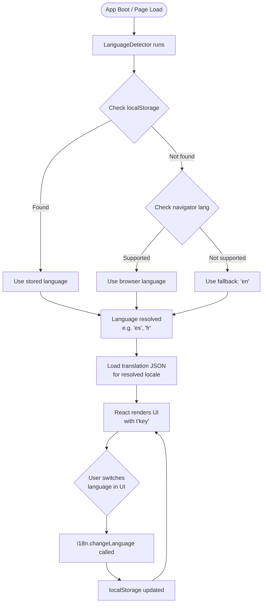

# Internationalization (i18n) System - Documentation

## Overview

The i18n system enables the application to support multiple languages, allowing users to interact with the UI in their preferred language. The implementation uses **i18next** and **react-i18next**, providing automatic language detection, persistent user preference storage, and seamless runtime switching between **4 languages**: English, Spanish, French, and Catalan.

---

## Supported Languages

| Code | Language  | Translation File               |
|------|-----------|--------------------------------|
| `en` | English   | `local/en/translation_en.json` |
| `es` | Spanish   | `local/es/translation_es.json` |
| `fr` | French    | `local/fr/translation_fr.json` |
| `ca` | Catalan   | `local/ca/translation_ca.json` |

> **Fallback:** If a translation key is missing or the detected language is unsupported, the system automatically falls back to **English (`en`)**.

---

## System Architecture

### Library Stack

| Library                        | Role                                              |
|-------------------------------|---------------------------------------------------|
| `i18next`                     | Core i18n engine — key lookup, interpolation, fallback |
| `react-i18next`               | React bindings — provides `useTranslation` hook   |
| `i18next-browser-languagedetector` | Automatic detection from browser / localStorage |

### Language Detection Strategy

Detection runs in the following **priority order** (first match wins):

```
1. localStorage     ← User previously chose a language manually
2. navigator        ← Browser's configured language setting
3. fallbackLng: en  ← Default if nothing matched above
```

The user's explicit choice is **cached in `localStorage`**, so it persists across sessions and page reloads. No server-side storage is required for language preference.

---

## Flow Diagram



---

## Configuration Reference (`i18n.ts`)

```typescript
import i18n from 'i18next';
import { initReactI18next } from 'react-i18next';
import LanguageDetector from 'i18next-browser-languagedetector';

import en from './local/en/translation_en.json';
import es from './local/es/translation_es.json';
import fr from './local/fr/translation_fr.json';
import ca from './local/ca/translation_ca.json';

i18n
  .use(LanguageDetector)
  .use(initReactI18next)
  .init({
    resources: {
      en: { translation: en },
      es: { translation: es },
      fr: { translation: fr },
      ca: { translation: ca },
    },
    fallbackLng: 'en',
    debug: true,
    detection: {
      order: ['localStorage', 'navigator'],
      caches: ['localStorage'],
    },
    interpolation: {
      escapeValue: false, // React already escapes by default
    }
  });

export default i18n;
```

### Key Configuration Options

| Option         | Value                        | Purpose                                       |
|---------------|------------------------------|-----------------------------------------------|
| `fallbackLng` | `'en'`                       | Language used when key or locale is not found |
| `debug`        | `true`                       | Logs missing keys to the browser console      |
| `escapeValue`  | `false`                      | Avoids double-escaping (React handles XSS)    |
| `caches`       | `['localStorage']`           | Persists the user's choice between sessions   |
| `order`        | `['localStorage','navigator']` | Detection priority chain                    |

---

## File Structure

```
src/
├── i18n.ts                         ← i18n configuration & init
└── local/
    ├── en/
    │   └── translation_en.json     ← English translations
    ├── es/
    │   └── translation_es.json     ← Spanish translations
    ├── fr/
    │   └── translation_fr.json     ← French translations
    └── ca/
        └── translation_ca.json     ← Catalan translations
```

---

## Usage in Components

### Basic Translation

Import the `useTranslation` hook and call `t()` with the translation key:

```typescript
import { useTranslation } from 'react-i18next';

const MyComponent = () => {
  const { t } = useTranslation();

  return <h1>{t('welcome')}</h1>;
};
```

### Translation Keys Used in the App

Keys follow a namespaced dot-notation pattern to group related strings:

```typescript
t('user')              // → "User" / "Usuario" / "Utilisateur" / "Usuari"
t('lang')              // → "Language" / "Idioma" / etc.
t('cumple')            // → "Birthday"
t('prof.field_id')     // → "ID"
t('prof.field_country')// → "Country"
t('prof.sel_country')  // → "Select a country"
t('prof.sel_lang')     // → "Select a language"
t('prof.loading_countries') // → "Loading countries..."
t('prof.field_oauth')  // → "Login provider"
```

### Switching Language Programmatically

The language switcher in the UI calls `i18n.changeLanguage()`:

```typescript
import { useTranslation } from 'react-i18next';

const LanguageSwitcher = () => {
  const { i18n } = useTranslation();

  const handleChange = (lang: string) => {
    i18n.changeLanguage(lang); // Updates localStorage & re-renders
  };

  return (
    <select onChange={(e) => handleChange(e.target.value)} value={i18n.language}>
      <option value="en">English</option>
      <option value="es">Español</option>
      <option value="fr">Français</option>
      <option value="ca">Català</option>
    </select>
  );
};
```

---

## Examples

### Example 1: User with Browser Set to French

**Scenario:** First visit, no localStorage entry.

```
Detection order:
  1. localStorage → ❌ not found
  2. navigator    → ✅ "fr" detected

Result: UI renders in French
        "fr" is cached in localStorage for next visit
```

### Example 2: User Manually Switches to Catalan

**Scenario:** User was on English, switches via the language switcher.

```
Action: i18n.changeLanguage('ca')

Result:
  - UI re-renders in Catalan immediately ✅
  - localStorage["i18nextLng"] = "ca" ✅
  - Next page load → localStorage check finds "ca" → loads Catalan ✅
```

### Example 3: Missing Translation Key

**Scenario:** A key exists in English but is missing in French.

```
t('some.missing.key') with language = 'fr'

Result:
  - i18next tries French → ❌ key not found
  - Falls back to English → ✅ renders English string
  - Debug mode logs: "i18next: key 'some.missing.key' not found in 'fr'"
```

---

## Adding a New Language

To add a new language (e.g., German):

**1. Create the translation file:**
```
src/local/de/translation_de.json
```

**2. Add all keys mirroring an existing translation file:**
```json
{
  "user": "Benutzer",
  "lang": "Sprache",
  ...
}
```

**3. Import and register in `i18n.ts`:**
```typescript
import de from './local/de/translation_de.json';

// Inside .init({ resources: { ... } })
de: { translation: de },
```

**4. Add to the language switcher UI:**
```typescript
<option value="de">Deutsch</option>
```

That's it! ✅ No other changes required.

---

## Adding a New Translation Key

To add a new translatable string:

**1. Add the key to all 4 translation files:**

`translation_en.json`
```json
{ "new_key": "New string in English" }
```
`translation_es.json`
```json
{ "new_key": "Nueva cadena en español" }
```
`translation_fr.json`
```json
{ "new_key": "Nouvelle chaîne en français" }
```
`translation_ca.json`
```json
{ "new_key": "Nova cadena en català" }
```

**2. Use the key in the component:**
```typescript
<p>{t('new_key')}</p>
```

> ⚠️ If a key is added to some files but not all, the `fallbackLng: 'en'` mechanism will render the English string silently for missing locales. Enable `debug: true` during development to catch these cases in the console.

---

## Technical Decisions

### Why i18next?

| Alternative          | Reason Not Chosen                                        |
|---------------------|----------------------------------------------------------|
| Manual string maps   | ❌ No detection, no fallback, no tooling                 |
| react-intl (FormatJS)| ❌ More verbose API, ICU message format adds complexity  |
| Custom context       | ❌ Reinvents the wheel, maintenance burden               |
| **i18next** ✅       | ✅ Mature, widely adopted, automatic detection, fallback |

### Why localStorage over Cookie or Session?

- **localStorage** survives browser restarts and doesn't expire ✅
- **Cookies** require server-side handling and add request overhead ❌
- **sessionStorage** is lost when the tab closes ❌

### Why Separate JSON Files per Language?

- Each file is loaded independently — no unnecessary payload for unused languages ✅
- Easy for translators to work on a single file without touching code ✅
- Clear diff history in version control per language ✅

---

## Known Limitations

- `debug: true` should be set to `false` in production builds to avoid verbose console output.
- Dynamic content (e.g., country names fetched from the API) is not translated by this system — those strings come from the database and must be handled server-side or via a separate lookup table.
- No pluralization rules are currently configured. If plural forms are needed in the future, i18next's built-in `_plural` suffix convention or the `i18next-icu` plugin should be adopted.
