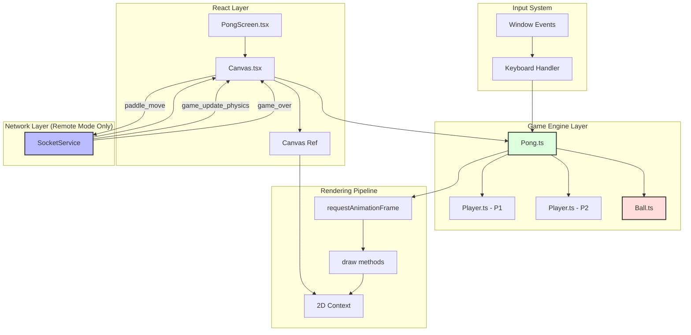
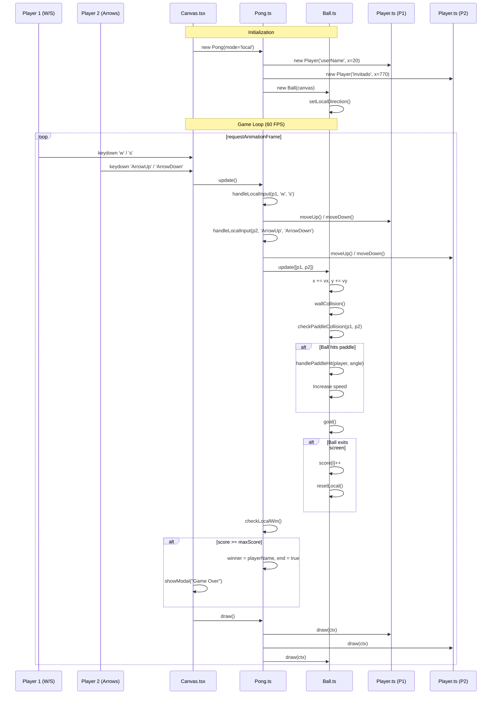
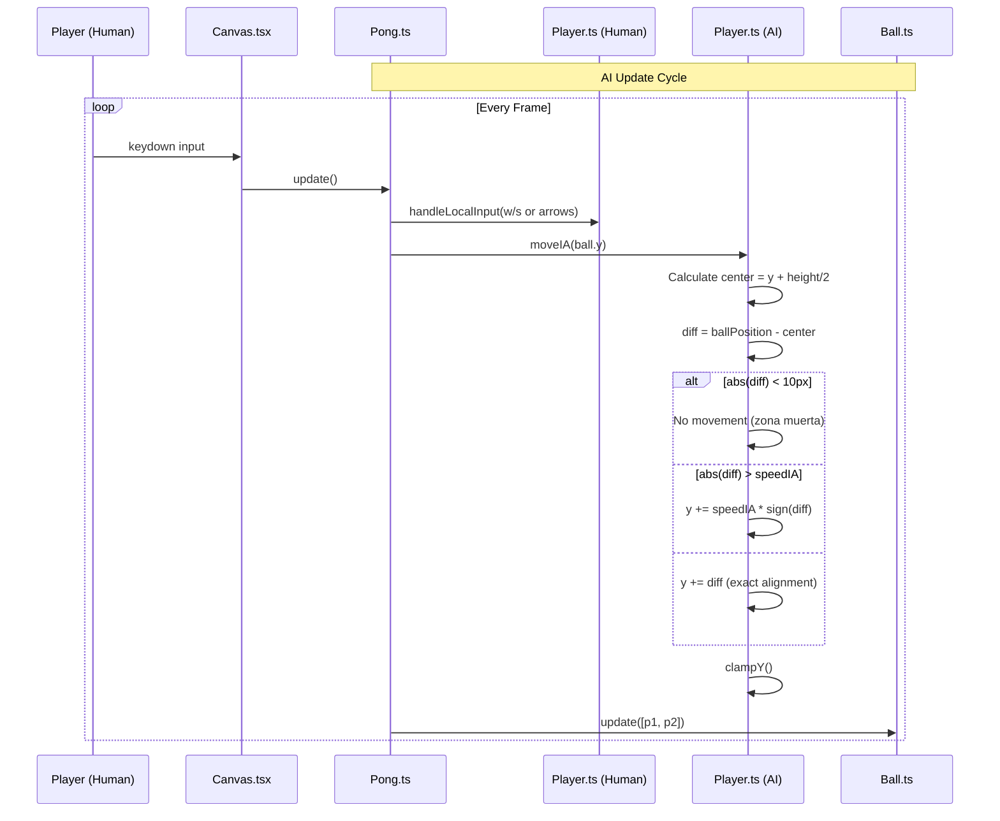
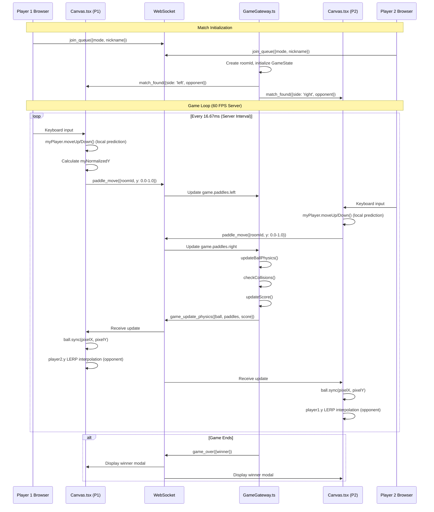
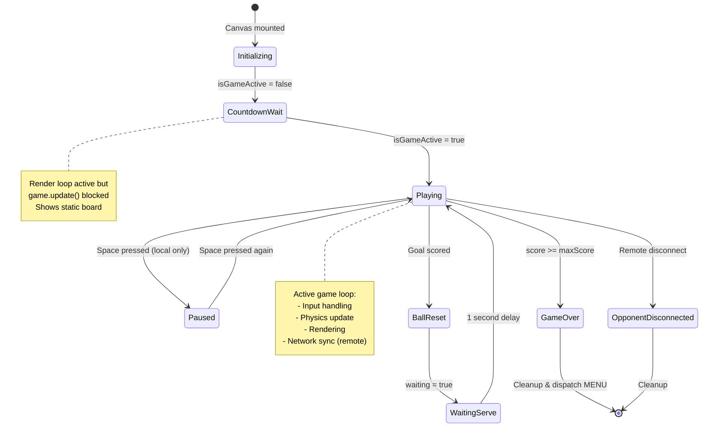
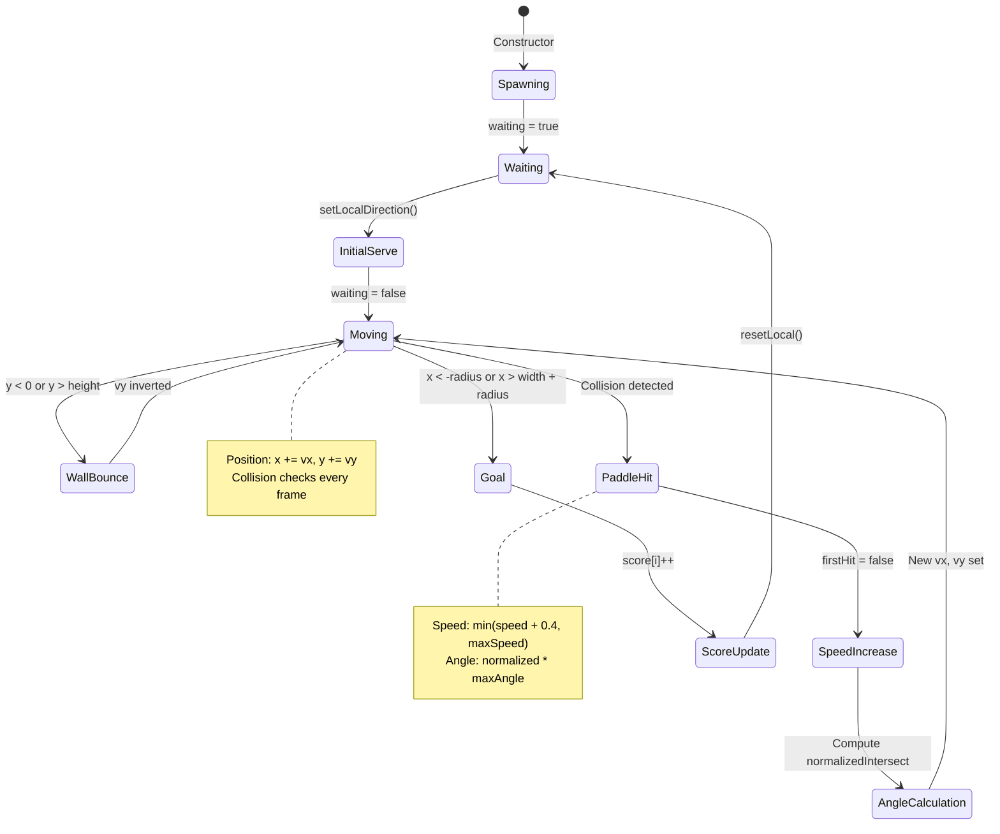
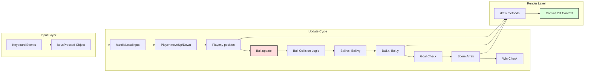
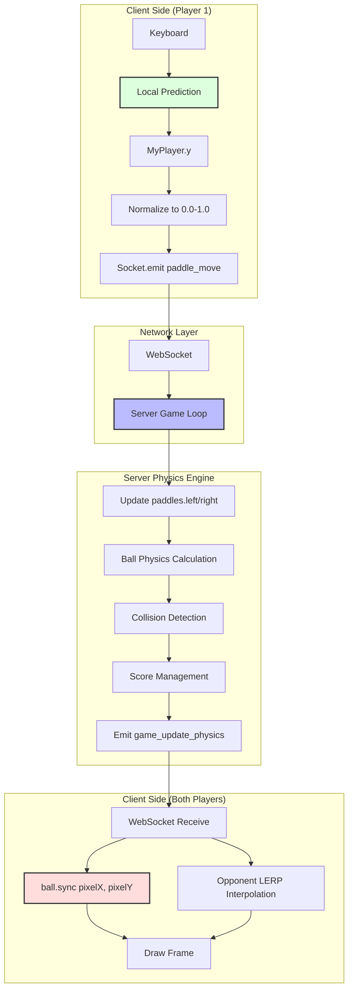

# Pong Game - Frontend Documentation

## Executive Summary

The frontend implementation establishes a high-performance, multi-mode Pong game architecture supporting three distinct gameplay flavors: local player-versus-player (PvP), local player-versus-AI (PvIA), and remote networked multiplayer. By leveraging TypeScript class-based models for game entities and React functional components for rendering, the system achieves deterministic physics simulation for local modes while seamlessly integrating WebSocket-driven server-authoritative gameplay for remote sessions.

The architecture is meticulously structured to decouple rendering concerns from game logic, ensuring that ball trajectory calculations, paddle collision detection, and input handling remain modular and testable. Real-time synchronization employs a hybrid "Trust Local + Interpolate Remote" strategy to minimize perceived latency while maintaining competitive integrity.

---

## System Architecture Overview

### Component Hierarchy Diagram



---

## Game Mode Comparison

| Mode | Physics Calculation | Input Handling | Score Management | Network |
|------|-------------------|----------------|------------------|---------|
| **local** (PvP) | Client-side (`Ball.update`) | P1: W/S, P2: Arrow Keys | Client-side | None |
| **ia** (PvIA) | Client-side (`Ball.update`) | Player: W/S or Arrows, AI: `moveIA` | Client-side | None |
| **remote** / **tournament** | Server-side (60 FPS) | Client sends normalized Y | Server-authoritative | WebSocket |

---

## Sequence Diagrams

### Local Mode (PvP) - Complete Game Flow



### AI Mode - AI Movement Logic



### Remote Mode - WebSocket Synchronization



---

## State Machine Diagrams

### Game State Flow



### Ball State Machine



---

## Data Flow Diagrams

### Local Mode Data Flow



### Remote Mode Data Flow



---

## Component Reference Documentation

### Ball.ts - Physics & Trajectory Engine

**Purpose**: Manages ball position, velocity, collision detection, and scoring logic for local game modes.

**Key Properties**:
```typescript
// Física (Necesarias para modo Local)
speed: number;           // Current scalar speed
initialSpeed: number;    // Starting speed (5)
baseSpeed: number;       // Speed after first hit (10)
maxSpeed: number;        // Speed ceiling (20)
increaseSpeed: number;   // Acceleration per hit (0.4)
vx: number;             // X velocity component
vy: number;             // Y velocity component

// Estado
firstHit: boolean;      // Triggers baseSpeed activation
waiting: boolean;       // Pauses physics during serve delay
maxAngle: number;       // Maximum reflection angle (π/4)
```

**Core Methods**:

| Method | Parameters | Returns | Description |
|--------|-----------|---------|-------------|
| `constructor` | `c: HTMLCanvasElement` | - | Initializes ball at center with relative sizing (`radious = width * 0.008`), sets initial direction |
| `draw` | `ctx: CanvasRenderingContext2D` | `void` | Renders white circle at current position |
| `sync` | `x: number, y: number` | `void` | **Remote mode only**: Directly updates position from server data |
| `update` | `players: Player[] \| Player, p2?: Player` | `void` | **Local mode only**: Executes physics loop with anti-tunneling protection |
| `wallCollision` | - | `void` | Detects and reflects ball from top/bottom walls |
| `checkPaddleCollision` | `p1: Player, p2: Player, prevX: number, prevY: number` | `void` | Raycasting-based collision with position correction |
| `handlePaddleHit` | `player: Player, hitY: number, direction: number` | `void` | Calculates new velocity based on impact point |
| `goal` | - | `void` | Detects scoring events and triggers `resetLocal()` |
| `resetLocal` | - | `Promise<void>` | Async 1-second delay before serving new ball |

**Anti-Tunneling Implementation**:
```typescript
// 1. Guardar posición previa (CRUCIAL para evitar túnel)
const prevX = this.x;
const prevY = this.y;

// 2. Mover bola temporalmente
this.x += this.vx;
this.y += this.vy;

// 4. Chequear colisión con Palas usando TRAYECTORIA (No solo posición)
this.checkPaddleCollision(player1, player2, prevX, prevY);
```

**Collision Detection Strategy**:
- Uses bounding box overlap detection (AABB)
- Determines relevant paddle based on ball's half-court position
- Applies position correction to prevent phasing through paddles:
  ```typescript
  if (player === p1) {
      this.x = pRight + this.radious + 1; // Push right
  } else {
      this.x = pLeft - this.radious - 1;  // Push left
  }
  ```

**Angle Calculation**:
```typescript
// Normalizamos el impacto (-1 arriba, 0 centro, 1 abajo)
const normalizedIntersect = (hitY - paddleCenterY) / (player.getHeight() / 2);

// Limitamos ángulo
const angle = normalizedIntersect * this.maxAngle;

// Calcular nueva velocidad
this.vx = direction * this.speed * Math.cos(angle);
this.vy = this.speed * Math.sin(angle);
```

---

### Player.ts - Paddle Entity

**Purpose**: Represents a paddle with movement capabilities for human players and AI opponents.

**Key Properties**:
```typescript
nickname: string;     // Display name
x: number;           // Horizontal position (fixed)
y: number;           // Vertical position (dynamic)
width: number;       // Always 10 pixels
height: number;      // 20% of canvas height
speed: number;       // Manual movement speed (10 px/frame)
speedIA: number;     // AI movement speed (5 px/frame)
canvasHeight: number; // For boundary clamping
color: string;       // Always "white"
```

**Core Methods**:

| Method | Parameters | Returns | Description |
|--------|-----------|---------|-------------|
| `constructor` | `name: string, x: number, h: number` | - | Centers paddle vertically, sets `height = h * 0.20` |
| `moveIA` | `ballPosition: number` | `void` | AI tracking with 10px dead zone to prevent oscillation |
| `moveUp` | - | `void` | Decreases `y` by `speed`, clamps to bounds |
| `moveDown` | - | `void` | Increases `y` by `speed`, clamps to bounds |
| `clampY` | - | `void` | Private boundary enforcement (`0 <= y <= canvasHeight - height`) |
| `draw` | `ctx: CanvasRenderingContext2D` | `void` | Renders white rectangle |
| `getNormalizedY` | - | `number` | Returns center position as 0.0-1.0 for server transmission |
| `setY` | `val: number` | `void` | **Remote mode**: Allows external position updates with clamping |

**AI Movement Logic**:
```typescript
moveIA(ballPosition: number) {
    const center = this.y + this.height / 2;
    const diff = ballPosition - center;

    // Zona muerta de 10px para evitar que la IA vibre si la bola está en el centro
    if (Math.abs(diff) < 10) return;

    if (Math.abs(diff) > this.speedIA)
        this.y += this.speedIA * Math.sign(diff);
    else
        this.y += diff;
    this.clampY();
}
```

**Normalized Position Calculation** (for remote sync):
```typescript
getNormalizedY(): number {
    // Posición visual (Top) + Mitad de altura = Centro
    const centerY = this.y + (this.height / 2);
    
    // Normalizamos (0.0 a 1.0)
    return centerY / this.canvasHeight;
}
```

---

### Pong.ts - Game State Manager

**Purpose**: Orchestrates game loop, input handling, mode-specific logic, and rendering coordination.

**Key Properties**:
```typescript
mode: GameMode;              // 'local' | 'ia' | 'remote' | 'tournament'
player1: Player;             // Left paddle
player2: Player;             // Right paddle
ball: Ball;
keysPressed: { [key: string]: boolean }; // Input state map
playerNumber: number;        // 1 (Left) or 2 (Right) for remote mode
score: number[];            // [P1 score, P2 score]
winner: string;             // Winner's name
maxScore: number;           // 5 points to win (local/IA only)
end: boolean;               // Game over flag
pause: boolean;             // Pause state (local modes only)
```

**Mode-Specific Input Schemes**:

| Mode | Player 1 Keys | Player 2 Keys | Notes |
|------|--------------|--------------|-------|
| `local` | W/S | Arrow Up/Down | Strict key binding |
| `ia` | W/S OR Arrow Up/Down | AI-controlled | Flexible for single player |
| `remote` / `tournament` | W/S OR Arrow Up/Down | N/A (opponent is remote) | Own paddle only |

**Core Methods**:

| Method | Parameters | Returns | Description |
|--------|-----------|---------|-------------|
| `constructor` | `c, ctx, mode, n, leftPlayerName, rightPlayerName, ballInit` | - | Initializes game state, syncs ball if `ballInit` provided |
| `moveOpponent` | `dir: 'up' \| 'down' \| 'stop'` | `void` | **Remote only**: Updates opponent's paddle visually |
| `update` | - | `void` | Main game loop logic, mode-specific physics delegation |
| `handleLocalInput` | `p: Player, upKey?, downKey?` | `void` | Private input processor with mode-aware key handling |
| `checkLocalWin` | - | `void` | Private win condition checker, sets `end` and `winner` |
| `draw` | - | `void` | Rendering orchestrator, calls entity draw methods |
| `drawScore` | - | `void` | Private HUD renderer for scores and names |
| `drawPause` | - | `void` | Private pause overlay |
| `drawNet` | - | `void` | Private center line decoration |

**Update Loop Logic**:
```typescript
update() {
    if (this.pause) return;

    // 1. MODO IA (Jugar contra Bot)
    if (this.mode === 'ia') {
        this.handleLocalInput(this.player1, 'w', 's'); // Humano (Izq)
        this.handleLocalInput(this.player1, 'ArrowUp', 'ArrowDown'); // Alternativa
        
        this.player2.moveIA(this.ball.y); 

        // Física Local
        this.ball.update([this.player1, this.player2]); 
        this.checkLocalWin();
    }
    
    // 2. MODO LOCAL (1 PC, 2 Humanos)
    else if (this.mode === 'local') {
        this.handleLocalInput(this.player1, 'w', 's'); // P1: WASD
        this.handleLocalInput(this.player2, 'ArrowUp', 'ArrowDown'); // P2: Flechas
        
        // Física Local
        this.ball.update([this.player1, this.player2]);
        this.checkLocalWin();
    }

    // 3. MODO REMOTO / TORNEO (Online)
    else {
        const myPlayer = this.playerNumber === 1 ? this.player1 : this.player2;
        this.handleLocalInput(myPlayer); 
    }
}
```

---

### Canvas.tsx - React Integration & Network Orchestration

**Purpose**: Manages React lifecycle, WebSocket event handling, render loop coordination, and mode-specific initialization.

**Component Props**:
```typescript
type CanvasProps = {
    mode: GameMode;                    // Game mode selector
    dispatch: React.Dispatch<any>;     // State machine dispatcher
    userName: string;                  // Current user's name
    opponentName?: string;             // Remote opponent name
    ballInit: { x: number, y: number } | null; // Server-provided initial position
    playerSide?: 'left' | 'right';     // Remote mode positioning
    roomId: string;                    // WebSocket room identifier
    isGameActive: boolean;             // Countdown gate
};
```

**Key Refs**:
```typescript
const canvasRef = useRef<HTMLCanvasElement>(null);    // Canvas DOM element
const animationIdRef = useRef<number | null>(null);   // RAF ID for cleanup
const gameRunningRef = useRef(false);                 // Unused legacy ref
const roomIdRef = useRef<string>(roomId);             // Stable room reference
const lastSentY = useRef<number>(0.5);                // Network throttling
const activeRef = useRef(isGameActive);               // Countdown blocker
```

**Initialization Logic**:
```typescript
// --- 1. LÓGICA DE POSICIONAMIENTO ---
let finalPlayerNumber = 1; 
let leftName = "P1";
let rightName = "P2";

if (mode.includes('remote') || mode === 'tournament') {
    if (playerSide === 'left') {
        finalPlayerNumber = 1;
        leftName = userName;
        rightName = opponentName;
    } else {
        finalPlayerNumber = 2;
        leftName = opponentName;
        rightName = userName;
    }
} 
else if (mode === 'ia') {
    leftName = userName;
    rightName = "IA-Bot";
} 
else {
    leftName = userName;
    rightName = "Invitado";
}
```

**WebSocket Event Handlers**:

| Event | Frequency | Purpose | Handler Logic |
|-------|-----------|---------|---------------|
| `game_update_physics` | 60 FPS | Server physics sync | Updates `ball.sync()`, applies LERP to opponent paddle |
| `game_over` | Once | Match completion | Cancels RAF, shows winner modal, dispatches MENU |
| `opponent_disconnected` | Once | Connection loss | Shows abandonment modal, awards win by forfeit |

**LERP Interpolation Strategy**:
```typescript
const LERP = 0.3;

if (game.playerNumber === 1) {
    // --- SOY JUGADOR 1 (Izquierda) ---
    
    // MI PALA (P1): NO LA TOCAMOS. 
    // Mi teclado la mueve en el renderLoop. Si la toco aquí, vibrará.
    
    // RIVAL (P2): Lo interpolamos suavemente hacia su destino
    game.player2.y = game.player2.y + (targetY_P2 - game.player2.y) * LERP;
} 
else if (game.playerNumber === 2) {
    // --- SOY JUGADOR 2 (Derecha) ---

    // MI PALA (P2): NO LA TOCAMOS.
    
    // RIVAL (P1): Lo interpolamos suavemente
    game.player1.y = game.player1.y + (targetY_P1 - game.player1.y) * LERP;
}
```

**Render Loop with Countdown Gate**:
```typescript
const renderLoop = () => {
    
    // BLOQUEO BUCLE PRINCIPAL En CUENTA ATRAS
    if (!activeRef.current) {
        // Si estamos en cuenta atrás:
        // DIBUJAMOS (para ver el tablero estático de fondo)
        game.draw(); 
        // Pero NO ACTUALIZAMOS (game.update() no se llama)
        
        // Pedimos siguiente frame y SALIMOS
        animationId = requestAnimationFrame(renderLoop);
        return; 
    }
    
    // 1.Si activeRef.current es TRUE. Mover pala localmente
    game.update(); 
    game.draw(); 

    // --- CONTROL DE VICTORIA LOCAL / IA ---
    if (!mode.includes('remote') && mode !== 'tournament') {
        if (game.hasWinner()) {
            const winnerName = game.getWinner();
            cancelAnimationFrame(animationId);
            
            setTimeout(() => {
                showModal({
                    title: "🏆 ¡PARTIDA FINALIZADA!",
                    message: `Ganador: ${winnerName}`,
                    type: "success",
                    onConfirm: () => {
                        dispatch({ type: "MENU" });
                    }
                });
            }, 50);
            return; 
        }
    }
    
    // 2. ENVIAR POSICIÓN AL SERVIDOR
    if (mode.includes('remote') || mode === 'tournament') {
        const myPlayer = game.playerNumber === 1 ? game.player1 : game.player2;
        
        // --- CÁLCULO DE COORDENADA ABSOLUTA ---
        const myCenterPixel = myPlayer.y + (myPlayer.height / 2);
        const myNormalizedY = myCenterPixel / canvas.height;

        // 3. Enviar solo si ha cambiado (para no saturar)
        if (roomIdRef.current && Math.abs(myNormalizedY - lastSentY.current) > 0.001) {
            
            socket.emit('paddle_move', { 
                roomId: roomIdRef.current, 
                y: myNormalizedY
            });
            lastSentY.current = myNormalizedY;
        }
    }

    animationId = requestAnimationFrame(renderLoop);
};
```

**Network Position Transmission**:
- Converts pixel-based paddle position to normalized 0.0-1.0 range
- Throttles updates using 0.001 delta threshold
- Sends `paddle_move` events with room ID and normalized Y coordinate

**Cleanup Procedure**:
```typescript
return () => {
    cancelAnimationFrame(animationId);
    window.removeEventListener("keydown", handleKeyDown);
    window.removeEventListener("keyup", handleKeyUp);
    socket.off('game_update_physics');
    socket.off('game_over', handleGameOver);
    socket.off('opponent_disconnected', handleOpponentDisconnected);
};
```

---

## Performance Considerations

### Frame Rate Management

| Context | Rate | Method | Notes |
|---------|------|--------|-------|
| Local render loop | ~60 FPS (browser-dependent) | `requestAnimationFrame` | Adaptive to monitor refresh rate |
| Remote server physics | Fixed 60 FPS (16.67ms) | `setInterval` | Server-side game loop |
| Network updates | Variable | WebSocket events | Depends on server broadcast frequency |

### Optimization Strategies

1. **LERP Interpolation (0.3 factor)**: Smooths opponent paddle movement while maintaining responsiveness
2. **Position Delta Threshold (0.001)**: Reduces network traffic by filtering negligible movements
3. **Bounding Box Collisions**: AABB checks are computationally cheaper than circle-to-rectangle
4. **Half-Court Paddle Selection**: Reduces collision checks from 2 to 1 per frame
5. **Countdown Gate**: Prevents physics calculations during pre-game phase while maintaining visual feedback

### Memory Management

- **useRef for Animation ID**: Prevents stale closure issues in RAF loop
- **useRef for Room ID**: Avoids dependency array triggers
- **WebSocket Event Cleanup**: Prevents memory leaks on component unmount
- **RAF Cancellation**: Ensures render loop termination

---

## Testing & Debugging

### Console Logging Strategy

The codebase includes strategic logging for debugging:

```typescript
console.log(`🎮 INICIANDO JUEGO [${mode}] | Soy: ${finalPlayerNumber} (${playerSide})`);
console.log(`⚔️ MATCH: ${leftName} (Izda) vs ${rightName} (Dcha)`);
```

### Common Issues & Solutions

| Issue | Symptom | Cause | Solution |
|-------|---------|-------|----------|
| Paddle vibration in remote | Jittery opponent paddle | Server updates overriding local state | Never interpolate own paddle, LERP opponent only |
| Ball tunneling | Ball passes through paddle | High velocity, single-frame detection | Use raycasting with `prevX`, `prevY` |
| Network lag spikes | Choppy ball movement | Server updates delayed | LERP smoothing mitigates visual artifacts |
| Countdown visual freeze | Black canvas during countdown | `game.update()` blocked entirely | Call `game.draw()` even when `!activeRef.current` |
| Score desync | Different scores on clients | Client-side scoring in remote mode | Use server-authoritative `data.score` |

---

## Future Enhancement Opportunities

1. **Client-Side Prediction**: Implement ball trajectory prediction to reduce perceived latency in remote mode
2. **Input Buffering**: Queue inputs during lag spikes for smoother remote gameplay
3. **Replay System**: Record game states for post-match analysis
4. **Dynamic LERP Factor**: Adjust interpolation based on measured latency
5. **Spectator Mode**: Allow additional clients to observe matches without input
6. **Power-ups**: Extend `Ball.ts` with special effects and modifier logic
7. **Customizable Physics**: Expose speed, angle, and paddle size as configuration parameters

---

## References

- **RFC 6238** (TOTP Standard): Time-based synchronization principles applicable to network tick rates
- **RequestAnimationFrame API**: [MDN Documentation](https://developer.mozilla.org/en-US/docs/Web/API/window/requestAnimationFrame)
- **Socket.IO Client**: [Official Documentation](https://socket.io/docs/v4/client-api/)
- **AABB Collision Detection**: Axis-Aligned Bounding Box algorithm
- **LERP Interpolation**: Linear interpolation formula `lerp(a, b, t) = a + (b - a) * t`

---

**Document Version**: 1.0  
**Last Updated**: 2026-02-14  
**Authors**: Development Team  
**Confidentiality**: Internal Use Only
