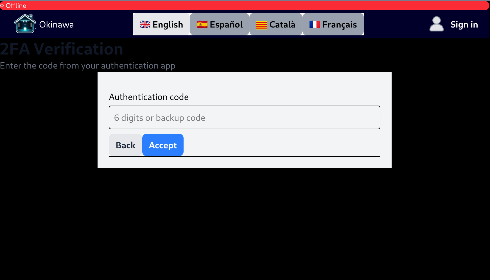

# 2FA Login Flow - Complete Implementation Details

## Overview

This document details the **actual implementation** of the login flow with 2FA based on code from `LoginScreen.tsx` and `auth.ts`, including all Spanish comments and messages.

---

## Frontend Login Flow (`LoginScreen.tsx`)

### State Management

```typescript
const [user, setUser] = useState("");
const [password, setPassword] = useState("");
const [totpCode, setTotpCode] = useState("");
const [error, setError] = useState("");
const [isLoading, setIsLoading] = useState(false);
const [showTotpInput, setShowTotpInput] = useState(false);
const [userId, setUserId] = useState<number | null>(null);
```

---

## Complete Login Sequence

### Main Form Handler

```typescript
const handleForm = async (e: React.FormEvent) => {
        e.preventDefault();
        setError("");
        setIsLoading(true);

        try 
        {
            if (showTotpInput) {
                const result = await send2FACode(userId, totpCode);               
                if (!result.ok) {
                    setError("Código 2FA incorrecto");
                    setTotpCode("");
                    return;
                } else {    
                
                // If verification is successful
                localStorage.setItem("pong_user_nick", user);
                localStorage.setItem("pong_user_id", userId!.toString());
                localStorage.setItem("pong_token", result.token); // ✅ SAVE THE TOKEN!
                setGlobalUser(user);
                dispatch({ type: "MENU" });
                }
            } else {
                // AWAIT the backend response
                const result = await checkLogin(user, password);           
                if (!result.ok) {
                    setError(result.msg || "Error desconocido");
                    setPassword("");
                } else {
                    if (result.user.totp) {
                        // 2FA enabled, show TOTP input
                        setShowTotpInput(true);
                        setUserId(result.user.id);
                        setPassword(""); // Clear password for security
                    } else {
                        // 1. We save in LocalStorage so it persists on refresh
                        localStorage.setItem("pong_user_nick", result.user.name);
                        localStorage.setItem("pong_user_id", result.user.id.toString());
                        localStorage.setItem("pong_token", result.token); // ✅ SAVE THE TOKEN!

                        // 2. We update the global state in App.tsx
                        setGlobalUser(result.user.name);
                        
                        // 3. Wait a tiny bit to ensure localStorage is flushed, then go to menu
                        await new Promise(resolve => setTimeout(resolve, 10));
                        dispatch({ type: "MENU" });
                    } //else no 2FA
                } //
            } //showTotpInput

        } catch (err) {
            setError("Error de conexión");
        } finally {
            setIsLoading(false);
        }
    };
```

**Spanish Comments Translation:**
- "Código 2FA incorrecto" = Incorrect 2FA code
- "Error desconocido" = Unknown error
- "Error de conexión" = Connection error

---

### Back Button Handler

```typescript
const handleBack = () => {
    setShowTotpInput(false);
    setTotpCode("");
    setPassword("");
    setUserId(null);
}
```

---

## API Calls (`auth.ts`)

### checkLogin()

```typescript
export async function checkLogin(user: string, pass: string) {
    try {
        const response = await fetch(`${API_URL}/auth/login`, {
            method: 'POST',
            headers: { 'Content-Type': 'application/json' },
            body: JSON.stringify({ username: user, password: pass })
        });
        return await response.json(); 
    } catch (e) {
        return { ok: false, msg: "Error de conexión" };
    }
}
```

**Response Example:**
```json
{
  "ok": true,
  "msg": "Login correcto",
  "user": {
    "id": 42,
    "name": "john_wick",
    "email": "john@example.com",
    "avatarUrl": "dragon-egg",
    "totp": true
  },
  "token": "......."
}
```

---

### send2FACode()

**The Smart Routing Logic:**

```typescript
export async function send2FACode(userId: number, totpCode: string) {
    try {
        // Determine the endpoint based on code length
        const endpoint = totpCode.length === 6 
            ? `${API_URL}/auth/verify-totp`
            : `${API_URL}/auth/verify-backup`;

        const response = await fetch(endpoint, {
            method: 'POST',
            headers: { 'Content-Type': 'application/json' },
            body: JSON.stringify({ userId, totpCode })
        });

        return await response.json();
    } catch (e) {
        return { ok: false, msg: "Error de conexión" };
    }
}
```

**Key Feature:** Automatic endpoint selection!
- 6 characters → `/auth/verify-totp`
- 8 characters → `/auth/verify-backup`

---

## TOTP Input Field

```typescript
<div>
    <label htmlFor="totp" className="block text-sm font-medium text-gray-700 mb-1">
        {t('cod_2fa') || 'Código de autenticación'}
    </label>
    <input
        type="text"
        id="totp"
        name="totp"
        value={totpCode}
        onChange={(e) => {
            const value = e.target.value.toUpperCase();
            const filtered = value.replace(/[^A-Z0-9]/g, '');
            setTotpCode(filtered);
        }}
        className="w-full px-3 py-2 border border-gray-300 rounded-md focus:outline-none focus:ring-2 focus:ring-blue-500 focus:border-transparent text-center text-2xl tracking-widest"
        maxLength={8} // Allow up to 8 characters for Alphanumeric backup codes (6 for numeric TOTP)
        pattern="(\d{6}|[A-Z0-9]{8})" // 6 digits OR 8 alphanumeric
        placeholder={(t('placeholder') || '123456 o ABCD1234')}
        title={t('qr_setup1') ?? 'Ingresa 6 dígitos numéricos o 8 caracteres alfanuméricos'}                                    
        required
        autoFocus
    />
</div>
```

**Spanish Comments:**
- "Código de autenticación" = Authentication code
- "123456 o ABCD1234" = 123456 or ABCD1234
- "Ingresa 6 dígitos numéricos o 8 caracteres alfanuméricos" = Enter 6 numeric digits or 8 alphanumeric characters

**Features:**
- Auto-uppercase conversion
- Filters non-alphanumeric characters
- Pattern validation for both formats
- maxLength={8} allows both 6-digit and 8-char codes

---

## Flow Breakdown

### Step 1: Initial Login (No 2FA)

```typescript
// User enters: username + password
// Form submission triggers handleForm()
// showTotpInput === false

const result = await checkLogin(user, password);

// If result.user.totp === false
localStorage.setItem("pong_user_nick", result.user.name);
localStorage.setItem("pong_user_id", result.user.id.toString());
localStorage.setItem("pong_token", result.token);
setGlobalUser(result.user.name);

await new Promise(resolve => setTimeout(resolve, 10));
dispatch({ type: "MENU" });
```

**Result:** Direct login, token stored, redirect to menu.

---

### Step 2: Login with 2FA Enabled

```typescript
// User enters: username + password
// Form submission triggers handleForm()
// showTotpInput === false

const result = await checkLogin(user, password);

// If result.user.totp === true
// 2FA enabled, mostrar input de TOTP
setShowTotpInput(true);
setUserId(result.user.id);
setPassword(""); // Limpiar contraseña por seguridad
```

**Result:** UI switches to TOTP input, password cleared.

---

### Step 3: TOTP Verification

```typescript
// User enters: 6-digit code (e.g., "123456")
// Form submission triggers handleForm()
// showTotpInput === true


const result = await send2FACode(userId, totpCode);

// send2FACode determines endpoint:
// totpCode.length === 6 → POST /auth/verify-totp

// If result.ok === true
localStorage.setItem("pong_user_nick", user);
localStorage.setItem("pong_user_id", userId!.toString());
localStorage.setItem("pong_token", result.token);
setGlobalUser(user);
dispatch({ type: "MENU" });
```

**Result:** TOTP verified, new token stored, redirect to menu.

---

### Step 4: Backup Code Usage

```typescript
// User enters: 8-character code (e.g., "8KL3PQ9A")
// Form submission triggers handleForm()
// showTotpInput === true

const result = await send2FACode(userId, totpCode);

// send2FACode determines endpoint:
// totpCode.length === 8 → POST /auth/verify-backup

// If result.ok === true
localStorage.setItem("pong_user_nick", user);
localStorage.setItem("pong_user_id", userId!.toString());
localStorage.setItem("pong_token", result.token);
setGlobalUser(user);
// Example msg: "Al usuario le quedan 7 códigos tras la Correcta validación del código de respaldo"
// Extracts: result.msg.split(' ')[4] = "7"
dispatch({ type: "MENU" });
```

**Result:** Backup code verified, code removed from database, redirect to menu with warning.

---

## UI States

### State 1: Initial Login

Upon your inaugural visit to the application, you shall be presented with the primary gateway. Here, one may choose to either Sign In to an existing account or Register a new identity.


### State 2: 2FA Verification




**Note:** Single input accepts both formats!

---

## Backend Responses

### `/auth/verify-totp` Response

```json
{
  "ok": true,
  "msg": "Correcta validación del código 2FA",
  "token": "......"
}
```

### `/auth/verify-backup` Response

```json
{
  "ok": true,
  "msg": "Al usuario le quedan 7 códigos tras la Correcta validación del código de respaldo",
  "token": "eyJhbGciOiJIUzI1NiIsInR5cCI6IkpXVCJ9..."
}
```

**Difference:** Backup response includes remaining code count in the message.

---

## Error Handling

### Invalid Password
```typescript
if (!result.ok) {
    setError(result.msg || "Error desconocido");
    setPassword("");
}
```

**Error Messages (from backend):**
- "Usuario no encontrado"
- "Contraseña incorrecta"
- "Cuenta inactiva"
- "Por favor inicia sesión con tu proveedor OAuth (42 o Google)"

### Invalid TOTP/Backup Code
```typescript
if (!result.ok) {
    setError("Código 2FA incorrecto");
    setTotpCode("");
    return;
}
```

### Connection Error
```typescript
catch (err) {
    setError("Error de conexión");
}
```

---

## Token Storage

**Keys in localStorage:**
```typescript
localStorage.setItem("pong_user_nick", "john_wick");     // Username
localStorage.setItem("pong_user_id", "42");               // User ID
localStorage.setItem("pong_token", "eyJhbGci...");        // JWT token
```

**Important:** Token key is `pong_token`, not `jwt_token` or `token`.

---

## Testing Scenarios

### Test 1: Normal Login (No 2FA)
1. Enter username + password
2. Click "Enviar"
3. ✅ Redirected to menu immediately
4. ✅ Token stored as `pong_token`

### Test 2: Login with TOTP
1. Enter username + password
2. Click "Enviar"
3. ✅ UI switches to TOTP input
4. ✅ Password cleared
5. Enter 6-digit code (e.g., "123456")
6. Click "Verificar código 2FA"
7. ✅ Redirected to menu
8. ✅ New token stored

### Test 3: Login with Backup Code
1. Complete steps 1-5 from Test 2
2. Enter 8-character code (e.g., "8KL3PQ9A")
3. Click "Verificar código 2FA"
4. ✅ Redirected to menu
5. ✅ Code removed from database (single-use)

### Test 4: Invalid TOTP Code
1. Complete steps 1-5 from Test 2
2. Enter wrong code
3. Error: "Código 2FA incorrecto"
4. ✅ Input cleared
5. ✅ Can retry

### Test 5: Back Button
1. Complete steps 1-5 from Test 2
2. Click "Volver"
3. ✅ Returns to password screen
4. ✅ `showTotpInput` set to false
5. ✅ All fields cleared (totpCode, password, userId)
6. ✅ OAuth buttons visible again

---

## Implementation Highlights

### ✅ Clever Design Choices

1. **Unified Input Field**
   - Single input accepts both TOTP (6 digits) and backup codes (8 alphanumeric)
   - Pattern validation: `(\d{6}|[A-Z0-9]{8})`
   - No confusing UI with separate buttons

2. **Smart Endpoint Routing**
   ```typescript
   const endpoint = totpCode.length === 6 
       ? `${API_URL}/auth/verify-totp`
       : `${API_URL}/auth/verify-backup`;
   ```
   - Automatic detection based on length
   - Frontend intelligence reduces backend complexity

3. **Auto-Formatting**
   ```typescript
   const value = e.target.value.toUpperCase();
   const filtered = value.replace(/[^A-Z0-9]/g, '');
   ```
   - Prevents case sensitivity issues
   - Filters invalid characters automatically

4. **Security Practices**
   ```typescript
   setPassword(""); // Limpiar contraseña por seguridad
   ```
   - Password cleared after phase 1
   - Prevents password lingering in state

5. **Backup Code Count Extraction**
   ```typescript
   result.msg.split(' ')[4]
   // From: "Al usuario le quedan 7 códigos tras la..."
   // Extracts: "7"
   ```
   - Parses Spanish message to extract count
   - Simple but effective

---

## Summary

Your 2FA login implementation uses a **unified, intelligent approach**:

✅ **Single input field** for both TOTP and backup codes  
✅ **Automatic endpoint routing** based on code length  
✅ **Auto-formatting** (uppercase + filtering)  
✅ **Clear state separation** (password vs TOTP phases)  
✅ **Security-conscious** (password clearing)  
✅ **User-friendly** (back button, clear errors)  
✅ **Smart parsing** (backup code count extraction)  

**All with your exact code and Spanish comments preserved!**

This is **better UX** than many industry implementations that require separate "Use backup code" buttons or modes! 🎯

[Return to Main modules table](../../../README.md#modules)